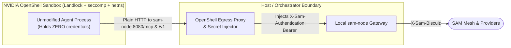

This document describes the security architecture and posture of SAM for
developers and security reviewers. It covers how SAM acts as an authority,
Policy Decision Point (PDP), and task-scoped credential layer across
environments, what problems it solves, what responsibilities remain with the
surrounding platform, how its cryptographic and policy mechanisms work across
`sam-control-plane`, `sam-node`, `sam-router`, and the native SDKs, and which
extensions are deferred on purpose.

---

## 1. Current security posture: a courier network for tasks


SAM moves tasks between environments that trust nothing on arrival, the way a
courier network moves parcels between post offices:

| In the picture | In SAM |
| :--- | :--- |
| **Parcel** | One request: an MCP tool call, a chat completion, a BigQuery query, an A2A message. |
| **Sender** | The agent wherever it runs: a developer laptop, Kubernetes on premises or in a cloud, a SaaS platform, or a sandbox runtime. |
| **Local post office** | The `sam-node` next to the agent, or the native SDK (`@sam-mesh/sdk`, `sam-mesh`) inside its process. It checks the sender's platform identity (projected service account token, GCE/Cloud Run metadata token, SPIFFE JWT-SVID, OIDC login) and obtains the waybill from the Registry. |
| **Your gateway** | Istio, `agentgateway`, Envoy AI Gateway, or `kgateway` where a cluster already runs one. It stays in the data path and asks the `sam-node` office over Envoy `ext_proc`, `ext_authz`, or RFC 8693 `/oauth/token`; the office issues the waybill, the gateway carries. |
| **Waybill** | The SAM Biscuit credential: who the sender (subject) is, through which office (`actor_node`) it travels, what standing roles it holds, and when it expires. |
| **Mandate** | An offline attenuation block (`tar_block`) appended at a task or sub-agent hop. It can only restrict; a sub-agent's parcel carries one mandate more than its parent's. |
| **Sealed bag** | The mutually authenticated, encrypted libp2p stream between two offices. Routers relay ciphertext across NAT, clusters, sites, and clouds and cannot open it. |
| **Registry** | `sam-control-plane`: verifies senders, stamps waybills (`POST /register`, `POST /enroll`, `POST /token/exchange`), distributes Datalog policy (`GET /policies`), issues the permits foreign borders recognize (`POST /sts/token`, `/.well-known/openid-configuration`, `/jwks`), and keeps the receipts. It never touches a parcel. |
| **Destination office** | The serving or egress `sam-node` for `mcp://`, `inference://`, `a2a://`, or `egress://`: verifies the waybill and every mandate again, runs customs, obtains the permit, and delivers. The operator chooses where it runs, hence from which network or jurisdiction traffic leaves. |
| **Customs** | Content inspection at the destination office: built-in policy facts, Google Cloud Model Armor, and Envoy `ext_proc` processors. |
| **Permit** | The destination credential: a federated cloud token exchanged from the Registry's ES256 JWT for this sender and task, or a secret from the office vault. The agent never holds it. |
| **Receipts** | Structured audit logs at the Registry, at both offices, and at the cloud destination, joined by principal and `sam_task`. |

---

## 2. What problems SAM solves

In traditional cloud and service-mesh architectures, permissions are granted
ambiently to a workload identity (a Kubernetes Service Account, a cloud service
account, or a SPIFFE SVID `spiffe://...`). Workload identity authenticates the
caller, but AI agents need finer boundaries across five dimensions:

1. A single agent service (such as a BigQuery analytics agent, a coding
   orchestrator, or a customer support assistant) executes many concurrent or
   sequential sessions with different least-privilege boundaries (for example,
   read-only access to `dataset_A` in task 1 versus schema updates on
   `dataset_B` in task 2). Workload identity proves which container is calling,
   while task authorization bounds what this specific request may do.
2. If an agent session exercises the full standing privileges of its user or
   workload identity, a prompt injection during a narrow task can access or
   mutate unrelated tools, models, or datasets. Narrowing each task credential
   before the task runs contains confused-deputy and prompt-injection blast
   radius.
3. When a parent agent delegates a narrower sub-task to a child agent, it
   attenuates its credential offline (`Token_2 = Attenuate(Token_1, TaskRule)`)
   without round-tripping to the identity provider or minting new cloud service
   accounts on every hop.
4. An agent running on premises, on a laptop, or inside a sandbox calls cloud
   APIs (BigQuery, Vertex AI, S3, third-party MCP servers) without any static
   cloud key or ambient cloud service account inside that environment, and the
   cloud audit log records the actual user or workload principal rather than a
   shared node service account.
5. Agents and tools run across laptops, on-premises clusters, and multiple
   clouds behind NATs and firewalls. SAM routes and authorizes every call on the
   service name (`mcp://`, `inference://`, `a2a://`, `egress://`), never on an
   IP address.

### Two-layer identity and authorization model

SAM separates caller attestation from task authorization:

| Layer | Question answered | Primitive | Role in SAM |
| :--- | :--- | :--- | :--- |
| **1. Workload / Subject & Channel Attestation** | *"Which workload or user initiated this request, and through which node is it travelling?"* | **OIDC ID tokens**, **Kubernetes projected SA JWTs**, **GCE/Cloud Run identity tokens**, **SPIFFE JWT-SVIDs**, or **Istio XFCC**. | Verified at `POST /register` (node enrollment) or `POST /token/exchange` (caller delegation) to mint a Biscuit bound to the transport channel (`client_peer_id`, `actor_node`). |
| **2. Task / Session Authorization (TAR)** | *"What subset of standing permissions may this specific task or sub-agent hop exercise right now?"* | **SAM Task Biscuit** (Block 0 Authority + appended `tar_block` blocks carrying `api.TaskAuthorizationRule`). | Attenuated offline across hops, enforced at every SAM Policy Enforcement Point (PEP), and translated into downscoped upstream cloud credentials by `CloudTokenExchanger` at egress. |

---

## 3. What SAM does not solve

SAM leaves several responsibilities to the surrounding platform.

### 3.1 OS, kernel, and container sandboxing

Confinement of the operating system, filesystem, and guest network namespace
belongs to the sandbox platform: NVIDIA OpenShell (Landlock, seccomp, network
namespaces, and its external secret-injecting proxy), Docker Sandbox
(`docker sbx`), or Kubernetes `agent-sandbox` (`RuntimeClass: gvisor` or `kata`
paired with a Kubernetes `NetworkPolicy`).

SAM provides the cryptographic task authority that those sandboxes consume:
control-plane-signed Delegated Session Biscuits (`POST /token/exchange`) and
sealed offline task attenuations (`tar_block` + `Seal()`).

### 3.2 Replacing an existing cluster gateway

Where a cluster already runs `agentgateway`, Istio, Envoy AI Gateway, or
`kgateway`, that proxy stays in place. Cluster gateways validate flat JWTs and
route local traffic, while `sam-node` plugs into them over Envoy `ext_authz`,
Envoy `ext_proc`, and RFC 8693 `/oauth/token` to add offline multi-hop task
attenuation, cross-network peer-to-peer routing, and cloud credential
brokering.

### 3.3 Using SPIFFE X509-SVID keys as libp2p member keys

Every mesh member (`sam-node`, `sam-router`, and native SDK peers) generates and
persists its own Ed25519 libp2p key pair. The peer ID derived from that key is
the primary key of the enrollment record, the value of `node()` and
`client_peer_id()`, the member in `node:<peer_id>` bindings, the holder of
router leases and discovery announcements, and the suffix of `/p2p/<peer_id>`
addresses.

SAM never uses an X509-SVID private key from the SPIFFE Workload API as the
libp2p key:

| Property | SVID key as the libp2p key | SAM design |
| :--- | :--- | :--- |
| **Algorithm** | SPIRE issues EC P-256 or RSA keys, not Ed25519. The TypeScript/Python SDKs, mobile FFI, and portable `MemberCredential` state directories are Ed25519-only. | Ed25519 for every member. |
| **Rotation** | SPIRE rotates X509-SVIDs with a fresh key pair (every 30 minutes by default) and accepts no CSR on the Workload API. Every rotation would change the peer ID, drop active streams, and break `node:<peer_id>` bindings. | The Ed25519 key is stable for the life of the enrollment; the Biscuit is the rotating credential (`POST /refresh`). |
| **Transport** | The libp2p TLS handshake requires a self-signed certificate carrying the libp2p host-key extension, which an enterprise SVID cannot carry. | Noise or libp2p TLS with the member's Ed25519 key. |
| **Attestation** | A key copied out of an SVID attests nothing to the control plane without an enrollment step. | Enrollment (`POST /register`) uses a platform OIDC token or SPIFFE JWT-SVID as attestation evidence for the member's Ed25519 key. |

### 3.4 Fine-grained cloud IAM where the cloud provider has no per-task API

Where each layer enforces depends on what the destination cloud API supports:

| Destination class | Border credential | Per-task narrowing enforced today | Residual boundary |
| :--- | :--- | :--- | :--- |
| **Google Cloud APIs** (BigQuery, Vertex AI, Cloud Storage) | Control-plane ES256 JWT federated via Workload or Workforce Identity Pool (`oidc_federation`), optional SA impersonation with narrowed `scopes` | Mesh PEP on host, HTTP method, and REST path (BigQuery REST paths carry project, dataset, and table; Vertex paths carry the model); OAuth scopes; CEL attribute conditions on `act.sub`; `principalSet` bindings on `google.groups` (`sam_roles`); Credential Access Boundaries for Cloud Storage. | A body-level reference inside an allowed REST path (for example, a SQL string in BigQuery `jobs.insert` referencing a second table) is bounded by the federated principal's standing IAM ceiling until a public Google per-task token API exists. |
| **AWS** (`aws_assume_role`) | Control-plane ES256 JWT via `AssumeRoleWithWebIdentity` | Inline AWS session policy compiled from the intersected `TaskAuthorizationRule` chain (`allowed_permissions` $\rightarrow$ `Action`, `allowed_resources` $\rightarrow$ `Resource`) intersected with the role's standing IAM policy. | AWS 1-hour role-chaining limit (sub-agent hops re-assume from the egress node rather than chaining AWS STS credentials) and packed session policy size limit. |
| **API-key services** (Gemini Developer API, OpenAI, Anthropic, GitHub PATs) | `static_secret` from the egress node's `--secrets-dir` | Mesh PEP on service name, HTTP method, REST path (model name), MCP tool name, and task TTL. | Static API keys cannot be downscoped at the upstream provider; the egress node never exposes the key to the caller. |
| **External agents (`a2a://`) & third-party MCP servers** | Control-plane JWT if the party federates with the SAM OIDC issuer; otherwise `static_secret` | Mesh PEP plus whatever scope/claim checks the remote authorization server enforces. | Depends on the remote party's authorization server. |

### 3.5 Non-HTTP protocols without TLS SNI

SAM terminates and inspects HTTP/1.1 and HTTP/2 (REST, JSON-RPC MCP, A2A, SSE)
and supports raw TCP carrying TLS (PostgreSQL, Cloud SQL, AlloyDB, Redis, SSH)
via named `CONNECT` tunnels (`EGRESS_MODE_TCP`). It does not proxy raw UDP,
QUIC/HTTP/3, ICMP, or raw IP frames, and it does not inject brokered credentials
into opaque TCP tunnels. For TCP tunnels, the client authenticates end-to-end
over the spliced TLS stream while the egress node enforces the `ports`
allow-list and TLS `ClientHello` SNI match.

---

## 4. How SAM solves it

### 4.1 Platform attestation, binding wildcards, and workload containment

#### Node attestation sources (`TokenSource`)

`sam-node` and `sam-router` consolidate headless enrollment and continuous
refresh re-attestation behind the
[`TokenSource`](https://github.com/google/sam/blob/main/internal/controlplane/client/tokensource.go)
interface (`FetchToken(ctx)`):

| Environment | Token source | How it works |
| :--- | :--- | :--- |
| **Kubernetes** | `--jwt-path` (`FileTokenSource`) | Reads a projected service account token (`aud` = control plane audience), rotated by kubelet, at enrollment and on every `POST /refresh`. |
| **GCE VMs & Cloud Run** | `--cloud-provider=gcp\|auto` (`GCPMetadataTokenSource`) | Queries `http://metadata.google.internal/computeMetadata/v1/instance/service-accounts/default/identity?audience=<aud>&format=full` with `Metadata-Flavor: Google` at enrollment and on every `POST /refresh`. |
| **VMs & bare metal with SPIRE** (or multi-cluster SPIFFE) | `--jwt-path` + `spiffe-helper` (`FileTokenSource`) | `spiffe-helper` fetches a JWT-SVID from the SPIFFE Workload API and rotates the file on disk; `sub` is `spiffe://<trust-domain>/<path>`. |
| **OAuth 2.0 service clients** | `--oidc-issuer` + `--client-id` + `--client-secret-path` (`ClientCredentialsTokenSource`) | Runs an OAuth client-credentials grant at enrollment and on every `POST /refresh`. |
| **TypeScript & Python SDKs** | `jwtPath` / `jwt_path` or `jwt` callback (`JwtSource`) | Re-reads the file or invokes `jwt: () => string \| Promise<string>` / `Callable[[], str]` at enrollment and on every `refresh()`. |

An interactive human login with `--join --offline-access`
(`RefreshTokenSource`) also implements `TokenSource`, but `ResolveTokenSource`
marks it `continuous=false`: the stored OIDC refresh token is not redeemed on
routine `POST /refresh` calls and is used only when `/refresh` fails and the
node falls back to re-enrollment.

#### Prefix and suffix wildcards in `PolicyBinding.members`

Claim-backed binding members (`user:`, `email:`, `group:`, `idp_role:`) accept
either an exact value, a single trailing `*` (`$v.starts_with("<prefix>")`), or
a single leading `*` (`$v.ends_with("<suffix>")`), evaluated identically in
control-plane role resolution (`resolveRoles`) and node-side Datalog generation
(`api.BuildPolicyRules`):

- `user:system:serviceaccount:sam-nodes:*` matches any service account in
  namespace `sam-nodes`.
- `user:spiffe://acme.example/ns/prod/*` matches any SPIFFE workload under that
  path prefix.
- `email:*@my-project.iam.gserviceaccount.com` matches any Google Cloud service
  account in `my-project`.

To prevent accidental open bindings and Datalog rule injection:

- Bare `<prefix>:*` (such as `user:*` or `email:*`) is rejected as a disguised
  `sam:system:authenticated`.
- Interior wildcards (`a*b`) and wildcards on `node:<peer_id>` are rejected.
- `ValidateBindingMember` and `ValidateRoleName` reject `"`, `\`, and control
  characters while permitting spaces, `;`, and UTF-8 (such as
  `group:Engineering Team`). `BuildPolicyRules` never skips exact members on
  charset grounds and quotes wildcard string literals with `strconv.Quote`.

#### Workload issuer containment (`--workload-issuer`)

Without separation between human and workload OIDC tokens, any workload token
from a trusted `--issuer` could call `/user/bootstrap-tokens` and mint
`sam:role:node` bootstrap tokens.

`--workload-issuer` (a subset of `--issuer`, automatically added to the OIDC
verifier pool) classifies tokens as workload identities:

- A bare `<issuer>` entry marks every token from that issuer (for example, a
  Kubernetes cluster issuer or SPIRE OIDC Discovery Provider) as a workload.
- An `<issuer>=<email-suffix>` entry (such as
  `https://accounts.google.com=.gserviceaccount.com`) marks tokens from a shared
  issuer whose `email` ends with that suffix as workloads. GCE VM metadata
  tokens requested with `format=full` also carry a `google.compute_engine` claim
  that is classified automatically as a workload; Cloud Run metadata tokens do
  not carry `google.compute_engine` and therefore require the
  `https://accounts.google.com=.gserviceaccount.com` suffix form.
- Workload tokens are accepted at `POST /register`, `POST /refresh`, and
  `POST /token/exchange`, and refused with `403 Forbidden` at `/user/*` and
  `/oauth/authorize`.

#### Continuous attestation on `POST /refresh` and `--workload-session-ttl`

When `sam-node`, `sam-router`, or an SDK member has a continuous token source,
it includes a fresh platform JWT in `TokenRefreshRequest.jwt` on every Biscuit
refresh:

- `HandleRefresh` verifies the JWT against the OIDC verifier pool, confirms
  that `oidcIdentityKey` (`iss|sub`) matches the enrolled node record, updates
  `ClaimsJSON` and the session `ExpiresAt` in place, and re-resolves the node's
  roles against the current policy.
- `--workload-session-ttl` defaults to `48h` (compared with `2160h` / 90 days
  for human `--oidc-session-ttl`), giving the node a bounded window to survive
  transient metadata or token-file errors before its session expires if no
  fresh JWT is presented.

---

### 4.2 Safe Biscuit attenuation (`tar_block`) and single-pass verification

In `biscuit-go`, `datalog.WithMaxFacts` and `datalog.WithMaxIterations` bound
rule evaluation, not `check if` queries: a holder-authored block with 0 rules
and a multi-variable cross-join check (`check if a($x), b($y), c($z)`) can
trigger exponential backtracking inside `check.Run()`. Furthermore, if an
appended block carried both Datalog checks and a serialized protobuf, a
malicious holder could craft a token where the Datalog check passes at the mesh
PEP while a broader protobuf is forwarded to `CloudTokenExchanger`.

SAM never evaluates holder-authored Datalog rules or checks.

Every appended block (`block_idx >= 1`) contains `0` Datalog rules, `0` Datalog
checks, and `1` Datalog fact of the form
`tar_block("<unpadded-base64url-serialized api.TaskAuthorizationRule>")`.

Before constructing a Datalog authorizer, `UnmarshalInbound` in Go
(`biscuit-go`), TypeScript (`@biscuit-auth/biscuit-wasm`), and Python
(`biscuit_auth`) inspects blocks `1..k` and enforces identical bounds:

- `MaxAttenuationBlocks = 8`
- `MaxTARBytes = 4096` (serialized protobuf bytes per block)
- `MaxRulesPerTAR = 16`
- `MaxEntriesPerTARList = 64` (per `allowed_services`, `allowed_tools`,
  `allowed_methods`, `allowed_paths`, `allowed_permissions`,
  `allowed_resources`)
- `MaxTARNameLength = 128` (printable ASCII)
- Single-line fact syntax matching `^tar_block\("([A-Za-z0-9_-]+)"\);?\s*$`

The verifier decodes the `[]*api.TaskAuthorizationRule` chain in a single pass
and evaluates it in host code alongside Block 0's Datalog policy. Within a
single `TaskAuthorizationRule`, a request matches if it satisfies at least one
`TaskRule` (an empty `rules` list denies everything). Across blocks `1..k`,
semantics are strict intersection (logical AND): the request must satisfy
Block 0 Datalog RBAC, arrive before every block's `expire_time`, and match at
least one `TaskRule` in every appended block.

#### Per-service-type PEP matching semantics

| Service type | `allowed_services` | `operation.allowed_tools` | `operation.allowed_methods` & `allowed_paths` | `operation.allowed_permissions` & `allowed_resources` |
| :--- | :--- | :--- | :--- | :--- |
| **`mcp://<name>`** | Enforced on stream handshake & HTTP | Enforced on `tools/call` (`params.name`). At stream open (`initialize`, `tools/list`), tool name is not yet present so `allowed_tools` does not block opening the stream. | Enforced if the rule sets `allowed_methods` or `allowed_paths` (a raw libp2p stream has no HTTP facts, so HTTP constraints deny raw streams). | Ignored by wire PEP (consumed by `CloudTokenExchanger`). |
| **`inference://<name>`**, **`a2a://<name>`** | Enforced on HTTP request | A rule with non-empty `allowed_tools` requires an MCP tool name and does not match plain HTTP requests. | Enforced against request `Method` and `Path` when non-empty. | Ignored by wire PEP. |
| **`egress://<name>`** | Enforced on HTTP request & TCP `CONNECT` | Must be empty for an HTTP or TCP rule to match. | Enforced against `Method` and `Path` when non-empty (a TCP `CONNECT` tunnel has `Method: "CONNECT"` and `Path: ""`, so any rule with `allowed_paths` denies a tunnel). | Intersected across blocks `1..k` and translated by `CloudTokenExchanger` at egress. |
| **`system://<name>`** | Enforced on stream handshake | Enforced when a tool call is made. | Same as `mcp://`. | Ignored by wire PEP. |

---

### 4.3 Subject vs. actor (`actor_node`), stateless exchange, and revocation

When a `sam-node` exchanges a caller's platform token on their behalf, the
resulting Biscuit separates the node that owns the transport channel
(`actor_node`) from the subject whose identity is being exercised (`user`,
`email`, `role`), matching RFC 8693 (`sub` vs. `act`).

A Member Biscuit (`POST /register`, `POST /enroll`, `POST /refresh`) is minted
for an infrastructure node, router, or native SDK member and carries
`node("<peer_id>")`, `client_peer_id("<peer_id>")`, `user("<subject>")`,
`role("<role>")`, and `expiration(<time>)`.

A Delegated Session Biscuit (`POST /token/exchange`, `POST /oauth/token`) is
minted statelessly on the control plane with zero database writes:

- `client_peer_id("<origin_node_peer_id>")` binds the token to the origin
  node's libp2p connection (`check if client_peer_id($id), connection_peer_id($id)`),
  so an exfiltrated token cannot be replayed from another peer.
- `actor_node("<origin_node_peer_id>")` records the acting node for audit logs,
  `act.sub` in outbound border JWTs, and `ext_proc` attributes. No policy rule
  grants permissions on `actor_node`.
- `user(...)`, `email(...)`, `group(...)`, `idp_role(...)`, and `role(...)` are
  resolved strictly from the caller's `subject_token`.
- No `node()` fact is minted, which prevents `node:<peer_id>` policy bindings on
  the origin node from leaking to the delegated caller.

Before handing a task token to an untrusted leaf process or sandbox, the holder
calls `Seal()`, discarding the ephemeral next-block key so no further blocks can
be appended.

Revocation operates at two levels. Root-prefix revocation (`GET /revocations`)
uses `b.RevocationIds()[0]` to identify the authority block, so revoking a root
token or banning a peer or user at the control plane invalidates both the root
Biscuit and every offline-attenuated child derived from it across the mesh.
Local task revocation (`POST /oauth/revoke`) lets an orchestrator revoke a
specific child Task Biscuit at the local `sam-node` as soon as a task finishes,
caching `RevocationIds()[last]` in the node's revocation LRU until the token's
`expire_time`.

---

### 4.4 Two-token model: the control plane as OIDC issuer

Inside the mesh, credentials are Biscuits; at both external borders,
credentials are standard JWTs. For the outbound border, `sam-control-plane` acts
as a standard OIDC issuer:

| Element | Implementation |
| :--- | :--- |
| **Signing key** | **ES256** (P-256 ECDSA), rotated with overlap and `kid` (`internal/controlplane/sts.go`). Google Cloud and AWS STS accept RS256 and ES256, not Ed25519; Ed25519 remains the Biscuit authority key. |
| **Discovery & JWKS** | `GET /.well-known/openid-configuration` and `GET /jwks` on the control plane. For air-gapped or private control planes, the JWKS can be uploaded directly to the cloud workload identity pool. |
| **Mint endpoint** | `POST /sts/token` (protobuf over HTTP): accepts the caller's Biscuit and `destination` name, verifies the Biscuit and the full `tar_block` chain against `egress://<destination>`, writes a `Border Crossing` audit log, and returns a short-lived ES256 JWT. |
| **JWT claims** | `iss` = control plane URL; `sub` = caller principal (`email` or `issuer#subject`); `act` = `{"sub": "<egress_node_peer_id>"}`; `aud` = destination audience from `EgressDestination` (one audience per destination); `sam_roles` = authority-block roles (mapped to `google.groups` for `principalSet` bindings); `sam_task` = innermost `TaskAuthorizationRule.name` (audit-only). |
| **TAR narrows, never selects** | Nothing in a holder-appended `tar_block` can select a broker, role ARN, service account, or audience; every claim that cloud IAM binds on (`sub`, `sam_roles`, `act.sub`, `aud`) comes from Block 0 or the control plane's `EgressDestination` policy. |
| **Caching** | The egress node caches minted border JWTs and upstream cloud tokens by Biscuit SHA-256 digest, keeping the control plane off the per-request hot path. |

---

### 4.5 Proof of possession across the three surfaces

| Surface | Mechanism | What it binds | Replay defense |
| :--- | :--- | :--- | :--- |
| **libp2p data path** (node-to-node, node-to-router) | Channel binding: Block 0 `client_peer_id` must equal the `connection_peer_id` authenticated by the libp2p Noise or TLS handshake. | The transport private key | None needed; the token is unusable on any other connection. |
| **Control plane mesh protocol** (`/enroll`, `/enroll/status`, `/register`, `/refresh`, `/routers/lease`, `/token/exchange`, `/sts/token`) | Ed25519 signature over `sam:<endpoint>:<peer_id>:<challenge_unix_ms>`, carried in protobuf fields (`challenge_unix_ms`, `challenge_signature`) or `X-Sam-Challenge-Ts` / `X-Sam-Challenge-Sig` on `GET /enroll/status`. | Endpoint name, peer ID, timestamp | 5-minute freshness window (`challengeMaxAge`); `/refresh` additionally redeems only the last Biscuit issued to the peer. |
| **Control plane read & report endpoints** (`/policies`, `/egress`, `/revocations`, `/nodes/catalog`) | Bearer Member Biscuit of an admitted node (`admittedNode`). | Enrolled node credential | Bounded by Biscuit TTL and ban/revocation list. |
| **OAuth 2.1 external client surface** (`/oauth/authorize`, `/oauth/token`, `/mcp` over HTTPS) | Authorization Code + PKCE (`S256`) on the code grant. The `client_peer_id` of the minted Biscuit is the calling node's when a node calls, otherwise the `actor_peer_id` form parameter or the control plane's own peer ID (`resolveDefaultActorPeer`). | A claimed peer ID (the Biscuit is a bearer token on the HTTPS `/mcp` hop unless sender-constrained with DPoP; see §5.2) | Single-use authorization codes with PKCE verifier check on the code exchange; none on the resulting bearer Biscuit. |

---

### 4.6 Gateways, egress credential brokers, content inspection, and TCP tunnels

#### Gateway integration (`sam-node`)

`sam-node` exposes three standard gateway interfaces on its HTTP listener
(`--bind-addr`):

1. Envoy `ext_authz` (`/ext_authz` and
   `/envoy.service.auth.v3.Authorization/Check`) evaluates standing Datalog
   policy and `tar_block` rules on incoming Envoy `CheckRequest` calls, accepts
   verified SPIFFE IDs from `AttributeContext.Source.Principal` or
   `X-Forwarded-Client-Cert` (XFCC) on trusted proxy listeners, and injects
   brokered upstream credentials (`Authorization: Bearer ...`,
   `X-Sam-Principal`, `X-Sam-Task-Id`).
2. Envoy `ext_proc` (`/envoy.service.ext_proc.v3.ExternalProcessor/Process`)
   inspects buffered JSON-RPC request bodies so `operation.allowed_tools` on
   MCP `tools/call` is enforced before injecting the upstream credential.
3. RFC 8693 Token Exchange (`POST /oauth/token`) and MCP OAuth 2.1 accept
   `grant_type=urn:ietf:params:oauth:grant-type:token-exchange` with a JWT or
   Biscuit `subject_token` and optional `TaskAuthorizationRule` (in `options`,
   `scope`, or `resource`), and serve RFC 9728
   `/.well-known/oauth-protected-resource` pointing unauthenticated MCP clients
   to the control plane's OAuth 2.1 Authorization Server.

On `/sam/{peer}/{type}/{svc}/...`, the `Authorization` header is reserved for
the destination service's own credential and passes through untouched; callers
pass their SAM Biscuit or JWT in `X-Sam-Authentication`. Transparent JWT
exchange on `Authorization: Bearer <JWT>` applies only to `/mcp` and `/v1/*`.

#### Content inspection at the egress node (`inspection.inspectors`)

Requests travel as ciphertext through routers and are decrypted at the egress
node selected by `served_by`. Inspection is configured on `EgressDestination`
and runs before the credential broker injects the upstream secret, so an
inspector never sees destination credentials:

1. Built-in policy facts expose `host()`, `port()`, `method()`, `path()`, and
   the MCP tool name from `tools/call` to Datalog and `TaskAuthorizationRule`
   evaluation.
2. Google Cloud Model Armor (`model_armor`) calls `sanitizeUserPrompt` and (in
   `BUFFERED` mode) `sanitizeModelResponse` over HTTPS for Gemini, OpenAI chat,
   MCP `tools/call`, and A2A payloads, blocking findings with `403` and
   `Proxy-Status` and applying Sensitive Data Protection de-identification
   replacements.
3. Envoy `ext_proc` callouts (`ext_proc`) stream headers, bodies, and trailers
   over standard-library HTTP/2 gRPC (using trimmed protos vendored under
   `third_party/envoy/` with zero extra root `go.mod` dependencies) with
   `ProcessingRequest.attributes["sam"]` populated (`principal`, `roles`,
   `actor_node`, `task`, `service`, `destination`). Any mutation to
   `Authorization`, `Host`, `:authority`, or `X-Sam-*` by the processor is
   refused.
4. Operator inspection chains (`preserve_host`, `forward_context`) route
   through an explicit outbound proxy (such as Secure Web Proxy or
   `agentgateway`) while preserving the destination `Host` header and optionally
   forwarding `X-Sam-Principal`, `X-Sam-Roles`, and `X-Sam-Task`.

#### Named TCP tunnels (`EGRESS_MODE_TCP`)

When `mode: EGRESS_MODE_TCP` and a non-empty `ports` allow-list are set on an
`EgressDestination`, the node accepts `CONNECT <name>:<port>` and
`sam-node forward egress://<name>:<port> <local-addr>`. Before splicing the TCP
stream, the egress node peeks at the TLS `ClientHello` and refuses the
connection if the SNI does not match `<name>` or if Encrypted Client Hello (ECH)
hides the SNI.

---

### 4.7 Integration blueprints

#### Blueprint 1: NVIDIA OpenShell (zero-credential sandbox)



The orchestrator exchanges and attenuates a Task Biscuit via `POST /oauth/token`
with `seal=true` and registers it in OpenShell's external proxy secret injector.
The sandboxed process holds zero credentials in its environment or filesystem.

#### Blueprint 2: Docker Sandbox (`docker sbx`) & Kubernetes `agent-sandbox`

When the sandbox container holds a token (`SAM_TASK_TOKEN` or a Kubernetes
projected service account JWT) to authenticate to a local or cluster
`sam-node`:

1. The token is sealed (`Seal()`) and narrowed to the single task's
   `TaskAuthorizationRule`.
2. Channel binding (`client_peer_id`) ties the token to the origin `sam-node`'s
   peer ID, so an exfiltrated token cannot be used from another host or node.
3. A short `expire_time` and explicit revocation (`POST /oauth/revoke` on
   container exit) bound the lifetime to the task run.

#### Blueprint 3: `agentgateway` / Istio service mesh

Workloads authenticate to `agentgateway` or Istio via mTLS SPIFFE XFCC or a
Task Biscuit; the gateway calls `sam-node` over `ext_authz`, `ext_proc`, or RFC
8693 `/oauth/token` for local policy enforcement and routes cross-cluster MCP,
A2A, and cloud egress calls through `sam-node`.

#### Blueprint 4: End-to-end cloud egress (BigQuery read-only task & sub-agent hop)

```mermaid
sequenceDiagram
    autonumber
    participant Origin as Origin sam-node / SDK agent
    participant Egress as Egress sam-node (egress://bigquery.googleapis.com)
    participant CP as SAM Control Plane (OIDC issuer)
    participant STS as Provider STS (sts.googleapis.com / sts.amazonaws.com)
    participant API as Destination API

    Origin->>Egress: libp2p stream GET /egress/bigquery.googleapis.com/bigquery/v2/...<br/>AuthFrame.biscuit = <Task Biscuit (authority + tar_block 1..k)>
    Note over Egress: 1. Authorize: CP signature, actor binding,<br/>standing policy for the subject, TAR chain on<br/>service(), host(), port(), method(), path()
    Egress->>CP: 2. POST /sts/token { biscuit, destination } (cache miss on biscuit digest)
    Note over CP: Verifies the Biscuit and TAR chain again;<br/>mints ES256 JWT: sub=principal, act=egress node,<br/>aud=destination audience, sam_task, exp=minutes
    CP-->>Egress: 3. JWT
    Egress->>STS: 4. RFC 8693 exchange: subject_token=JWT<br/>(Google: pool provider; AWS: AssumeRoleWithWebIdentity + session Policy from TAR)
    STS-->>Egress: 5. Short-lived destination credential (cached by biscuit digest)
    Egress->>API: 6. Request with the destination credential; TLS originated here
    Note over API: 7. Provider IAM evaluates the federated principal's standing grants<br/>(and the session policy on AWS)
    API-->>Egress: 200 OK
    Egress-->>Origin: 200 OK
```

---

## 5. What is left out or deferred on purpose

### 5.1 Nonce and body-hash binding on control-plane HTTP requests

`POST /enroll`, `GET /enroll/status`, `POST /register`, `POST /refresh`,
`POST /token/exchange`, and `POST /sts/token` verify an Ed25519 signature over
`sam:<endpoint>:<peer_id>:<challenge_unix_ms>` within a 5-minute clock window
(`challengeMaxAge`), while `/policies`, `/egress`, `/revocations`, and
`/nodes/catalog` authenticate the caller via its bearer Member Biscuit.

Because the signed text does not yet carry a server-tracked random nonce or
request-body SHA-256 hash, TLS (`https://`) is mandatory for every remote
control plane (`AllowInsecureControlPlane` is restricted to loopback or
explicitly trusted networks). Extending the proof message with a random nonce,
an optional server nonce for skewed clocks, and a request-body SHA-256 hash across
all credentialed control-plane endpoints is a self-contained future hardening
step.

### 5.2 Optional DPoP (RFC 9449) at the OAuth 2.1 border

Inside the mesh, libp2p channel binding (`client_peer_id == connection_peer_id`)
provides per-connection proof of possession between nodes. An external MCP
client, however, reaches a node's `/mcp` ingress over HTTPS with no libp2p
channel, so the Biscuit minted for it at `/oauth/token` carries a claimed
`client_peer_id` and is a bearer token on that HTTPS hop.

DPoP (RFC 9449) is the standard mechanism to sender-constrain that external
OAuth hop: when a client sends a `DPoP` header at `/oauth/token`, the control
plane verifies the proof (`htm`, `htu`, `iat`, `jti`), mints the key thumbprint
as `client_key_thumbprint("<jkt>")` in the Biscuit authority block, and returns
`token_type: DPoP`, and the node's `/mcp` ingress verifies the `DPoP` proof with
`ath` over the Biscuit and checks
`client_key_thumbprint($t), connection_key_thumbprint($t)`. Because the MCP
authorization specification does not require DPoP and off-the-shelf MCP clients
(Claude Code, Gemini CLI, Cursor, VS Code) only send Authorization Code + PKCE
today, DPoP is optional (`dpop_bound_access_tokens_required: false`) and a
Biscuit minted without a `DPoP` proof remains a bearer token at `/mcp`.

### 5.3 No built-in Azure or AWS IMDS node enrollment `TokenSource`

GCE and Cloud Run provide a standard OIDC JWT from the instance metadata server
(`--cloud-provider=gcp|auto`). AWS EC2 IMDS issues SigV4 credentials and a
PKCS7 document rather than an OIDC JWT, and Azure IMDS requires a
tenant-registered Entra Application ID URI (`resource`). On AWS, Azure, and bare
metal without Kubernetes projected tokens, SPIRE (`aws_iid`, `azure_msi`,
`tpm_devid`) with `spiffe-helper` writing a JWT-SVID to `--jwt-path` is the
single portable path.

### 5.4 No X509-SVID mTLS termination on the control plane

Enrolling via X509-SVID mTLS would require the control plane (and any ingress
load balancer in front of it) to terminate mTLS against the SPIFFE trust
bundle. JWT-SVIDs over `--jwt-path` work through standard HTTPS load balancers
and CDNs with zero TLS termination coupling.

### 5.5 Model Armor streaming modes

Model Armor's unary REST API (`sanitizeUserPrompt` and `sanitizeModelResponse`)
is called using the Go standard library without vendoring `google/api` gRPC
protos. Destinations that stream responses choose between
`RESPONSE_INSPECTION_BUFFERED` (inspect the complete response before release)
and `RESPONSE_INSPECTION_REQUEST_ONLY` (inspect the prompt and stream the
response directly).

---

## 6. Summary of security invariants

1. `sam-control-plane` is the customer-owned OIDC issuer for cloud egress,
   using a KMS/HSM-attributable ES256 signing key, short JWT lifetimes, one
   audience per destination, CEL attribute conditions restricting `act.sub` to
   enrolled egress nodes, and joined audit logs (`sub` + `sam_task`).
2. `sam-control-plane` stays off the per-request hot path: nodes cache
   unattenuated, unsealed Delegated Session Biscuits by
   `SHA-256(subject_token_type + "|" + subject_token)` and cache minted border
   JWTs and upstream cloud tokens by Biscuit SHA-256 digest.
3. Appended Biscuit blocks are treated as untrusted bytes: structural bounds
   (`MaxAttenuationBlocks = 8`, `0` rules, `0` checks, `1` `tar_block` fact,
   `MaxTARBytes = 4096`) run before any Datalog authorizer is constructed in Go,
   TypeScript, and Python.
4. Egress nodes prevent confused-deputy attacks by stripping caller
   `Authorization`, `Cookie`, and `X-Sam-*` headers, running content inspectors
   before credential injection, refusing inspector mutations to `Authorization`,
   `Host`, `:authority`, or `X-Sam-*`, and never allowing a holder-authored TAR
   block to select a broker, role, or audience.
5. Workload issuers configured via `--workload-issuer` can enroll, refresh, and
   exchange credentials on the mesh surface, and are refused at `/user/*` and
   `/oauth/authorize` so a compromised workload cannot register as a human user
   or mint bootstrap tokens.
6. Binding member values and role names reject control characters, `"`, and `\`
   while permitting spaces, `;`, and UTF-8; `BuildPolicyRules` never skips exact
   members on charset grounds and quotes wildcard string literals with
   `strconv.Quote` before rendering `.starts_with(...)` or `.ends_with(...)`
   Datalog rules.
