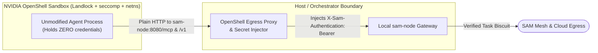

An autonomous agent runs untrusted or model-generated code and prompts. To run
one safely, you need two things that work together:

1. **OS and network confinement**, provided by a dedicated sandbox runtime
   (NVIDIA OpenShell, Kubernetes `agent-sandbox` with gVisor or Kata, or Docker
   Sandbox `docker sbx`), so the process can only talk to the local gateway.
2. **Task-scoped authorization and credential brokering**, provided by SAM
   (`sam-node` or `agentgateway` + `sam-node`), so the sandbox never holds a
   standing cloud credential or ambient workload token and can only call the
   services, MCP tools, HTTP paths, and cloud resources permitted for its
   current task.

This page shows the four deployment blueprints for connecting sandboxed agents
and multi-hop sub-agents to a SAM mesh.

## Blueprint 1: NVIDIA OpenShell (zero credentials inside the sandbox)

NVIDIA OpenShell isolates untrusted agent processes using Landlock, seccomp,
and network namespaces, routing all outbound HTTP through an external OpenShell
egress proxy on the host that injects headers outside the sandbox boundary.



1. **Mint and seal a task token before starting the task:**
   The orchestrator calls `POST /oauth/token` on the local `sam-node` with a
   `TaskAuthorizationRule` (and `seal=true`), receiving a **sealed Task
   Biscuit** scoped to the single task:
   ```bash
   TASK_TOKEN=$(curl -sS --unix-socket ~/.config/sam-mesh/sam.sock \
     http://localhost/oauth/token \
     -d 'grant_type=urn:ietf:params:oauth:grant-type:token-exchange' \
     -d 'subject_token_type=urn:sam-mesh:params:oauth:token-type:biscuit' \
     -d "subject_token=$(jq -r .biscuit ~/.config/sam-mesh/credential.json 2>/dev/null || true)" \
     -d 'seal=true' \
     --data-urlencode 'options={"name":"tasks/pr-review-42","rules":[{"allowed_services":["mcp://github","inference://*"],"operation":{"allowed_tools":["get_pull_request","list_PullRequest_files"]}}]}' \
     | jq -r .access_token)
   ```
2. **Register the sealed token in OpenShell's proxy:**
   Configure OpenShell's secret injector to attach
   `X-Sam-Authentication: Bearer $TASK_TOKEN` on requests to `sam-node:8080`.
   The sandboxed process has no credential in its environment variables or
   filesystem.

## Blueprint 2: Docker Sandbox (`docker sbx`) & Kubernetes `agent-sandbox`

In `docker sbx` (local microVM) and Kubernetes `agent-sandbox`
(`RuntimeClass: gvisor` or `kata`) without an external header-injecting proxy,
the sandbox container authenticates to `sam-node` using a task token passed as
`OPENAI_API_KEY` / `Authorization: Bearer <token>` (for `/mcp` and `/v1/*`) or
`X-Sam-Authentication: Bearer <token>` (for `/sam/*` and `/egress/*`).

### How SAM bounds the token held by the sandbox

1. **Sealed leaf token (`Seal()`):** The orchestrator hands the sandbox a
   sealed, task-attenuated Biscuit. The sandbox cannot append blocks or widen
   its permissions.
2. **Channel binding (`client_peer_id`):** The Biscuit's authority block binds
   `client_peer_id` to the local or cluster `sam-node`'s `peer_id`. If a
   prompt-injected agent exfiltrates the token to an external attacker, the
   token is rejected by every other node in the mesh because the attacker
   cannot authenticate over libp2p as that `peer_id`.
3. **Short TTL and explicit revocation on exit:** Scope the task's
   `expire_time` to the expected task duration (for example, 15 minutes) and
   revoke it on `sam-node` (`POST /oauth/revoke`) as soon as the sandbox exits:
   ```bash
   curl -sS --unix-socket ~/.config/sam-mesh/sam.sock \
     http://localhost/oauth/revoke \
     -d "token=$TASK_TOKEN"
   ```
4. **Standard Kubernetes isolation (`RuntimeClass: gvisor` + `NetworkPolicy`):**
   No `/dev/net/tun`, `CAP_NET_ADMIN`, or custom PID 1 wrapper is needed. The
   sandbox pod runs unprivileged under `gvisor` or `kata`, and a standard
   Kubernetes `NetworkPolicy` restricts its egress to the cluster `sam-node`
   (or `agentgateway`) Service:

```yaml
apiVersion: networking.k8s.io/v1
kind: NetworkPolicy
metadata:
  name: sandbox-to-sam-node-only
  namespace: agents
spec:
  podSelector:
    matchLabels:
      app: agent-sandbox
  policyTypes: [Egress]
  egress:
    - to:
        - namespaceSelector:
            matchLabels:
              kubernetes.io/metadata.name: sam-system
          podSelector:
            matchLabels:
              app: sam-node
      ports:
        - protocol: TCP
          port: 8080
```

## Blueprint 3: `agentgateway` and Istio service mesh

In clusters that already route agent traffic through **`agentgateway`**,
**Istio Ambient** (waypoints or sidecars), or **Envoy AI Gateway**, traffic
continues to flow through those proxies while `sam-node` serves as the Policy
Decision Point and Token Service:

- **Envoy `ext_authz` (`--ext-authz-addr`) and `ext_proc`:**
  Istio `AuthorizationPolicy (action: CUSTOM)` or `agentgateway` calls
  `sam-node`. When no Bearer token is present on a trusted proxy listener,
  `sam-node` reads the caller's verified SPIFFE ID from
  `AttributeContext.Source.Principal` or `X-Forwarded-Client-Cert` (XFCC),
  exchanges it into a Delegated Session Biscuit, evaluates the standing Datalog
  policy and any `TaskAuthorizationRule` chain (including MCP tool names in
  JSON-RPC bodies via `ext_proc`), and injects the upstream credential into
  `Authorization` before the gateway forwards the request.
- **RFC 8693 backend token exchange (`POST /oauth/token`):**
  `agentgateway`'s built-in RFC 8693 token exchange policy can point directly
  at `http://sam-node:8080/oauth/token` to exchange workload JWTs or narrow
  existing Biscuits per route.

## Blueprint 4: Multi-hop sub-agent delegation and cloud egress

When an agent delegates work to a sub-agent or calls a cloud API through an
egress node (`egress://bigquery.googleapis.com`), it attenuates its credential
offline in memory using the TypeScript or Python SDK (or `POST /oauth/token` on
`sam-node`).

### Example: two-hop attenuation in Python

```python
from datetime import datetime, timedelta, timezone
from google.protobuf.timestamp_pb2 import Timestamp
from agent_mesh import AgentMesh, sam_pb2

# Hop 1: Orchestrator narrows its session to read-only BigQuery sales_2026
# and two MCP tools for 15 minutes.
exp1 = Timestamp()
exp1.FromDatetime(datetime.now(timezone.utc) + timedelta(minutes=15))

hop1_session = session.attenuate(
    sam_pb2.TaskAuthorizationRule(
        name="tasks/session-bq-read-sales",
        expire_time=exp1,
        rules=[
            sam_pb2.TaskRule(
                allowed_services=["egress://bigquery.googleapis.com"],
                operation=sam_pb2.TaskOperation(
                    allowed_methods=["GET", "POST"],
                    allowed_paths=["/bigquery/v2/projects/my-proj/datasets/sales_2026/*"],
                    allowed_permissions=[
                        "bigquery.googleapis.com/datasets.get",
                        "bigquery.googleapis.com/tables.get",
                        "bigquery.googleapis.com/tables.getData",
                    ],
                ),
                allowed_resources=[
                    "//bigquery.googleapis.com/projects/my-proj/datasets/sales_2026/*",
                ],
            ),
            sam_pb2.TaskRule(
                allowed_services=["mcp://bigquery"],
                operation=sam_pb2.TaskOperation(allowed_tools=["list_tables", "query_sales"]),
            ),
        ],
    )
)

# Hop 2: Analytics agent spawns a leaf sub-agent restricted to table q1 only,
# and seals the credential so the sub-agent cannot append further blocks.
hop2_session = hop1_session.attenuate(
    sam_pb2.TaskAuthorizationRule(
        name="tasks/subagent-q1-only",
        rules=[
            sam_pb2.TaskRule(
                allowed_services=["egress://bigquery.googleapis.com"],
                operation=sam_pb2.TaskOperation(
                    allowed_methods=["GET"],
                    allowed_paths=["/bigquery/v2/projects/my-proj/datasets/sales_2026/tables/q1/*"],
                    allowed_permissions=["bigquery.googleapis.com/tables.getData"],
                ),
                allowed_resources=[
                    "//bigquery.googleapis.com/projects/my-proj/datasets/sales_2026/tables/q1",
                ],
            )
        ],
    )
).seal()
```

### Example: two-hop attenuation in TypeScript

```typescript
import { create } from "@bufbuild/protobuf";
import { timestampFromDate } from "@bufbuild/protobuf/wkt";
import { TaskAuthorizationRuleSchema } from "@sam-mesh/sdk/gen/sam_pb.ts";

const hop1 = session.attenuate(
  create(TaskAuthorizationRuleSchema, {
    name: "tasks/session-bq-read-sales",
    expireTime: timestampFromDate(new Date(Date.now() + 15 * 60_000)),
    rules: [
      {
        allowedServices: ["mcp://bigquery"],
        operation: { allowedTools: ["list_tables", "query_sales"] },
      },
    ],
  }),
);

const leafSession = hop1
  .attenuate(
    create(TaskAuthorizationRuleSchema, {
      name: "tasks/subagent-q1-only",
      rules: [
        {
          allowedServices: ["mcp://bigquery"],
          operation: { allowedTools: ["query_sales"] },
        },
      ],
    }),
  )
  .seal();
```

When `hop2_session` calls `egress://bigquery.googleapis.com`, the egress
`sam-node` verifies the Control Plane signature, the standing policy, and the
intersection of `TAR_1` and `TAR_2`, mints an ES256 border JWT at the control
plane (`POST /sts/token`), and exchanges it via `CloudTokenExchanger` for a
downscoped cloud token.

## Further reading

- [Agent architecture](../agent-architecture/): the two-token model, safe
  `tar_block` attenuation, `CloudTokenExchanger`, and content inspection.
- [Authorization](../../concepts/authorization/): standing Datalog policy and
  per-task `TaskAuthorizationRule` evaluation.
- [Node API](../../reference/node-api/): `/oauth/token`, `/oauth/revoke`,
  `ext_authz`, `ext_proc`, and `/egress/*`.
