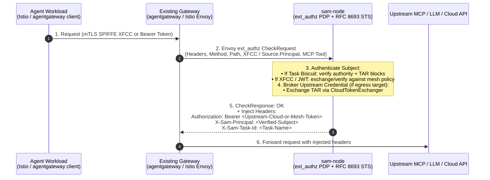
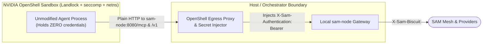

# SAM Design Doc: Task-Based Authorization, STS & PDP Architecture

* **Status:** Draft / Proposal (v3 — v2 incorporated the architecture and security review; v3 adds the two-token model with the control plane as OIDC issuer (section 3.5), the egress credential broker and per-destination narrowing (section 5), content inspection and non-HTTP protocols at the egress node (sections 5.6, 5.7), the security considerations (section 7) and the list of facts to verify before implementation starts (section 8)).
* **Context:** Evolving SAM from a custom sandbox network stack (`sam-box` / `nano-init`) into an **Authority, Policy Decision Point (PDP), and Task-Scoped Credential Layer** that composes with existing agent gateways (`agentgateway`, Istio, Envoy AI Gateway), sandbox runtimes (NVIDIA OpenShell, Docker Sandbox, Kubernetes `agent-sandbox`), and cloud providers (Google Cloud STS, AWS STS, Entra).
* **Primary CUJ:** an agent that runs on premises or inside a customer environment needs access to external services (BigQuery, Vertex AI and Gemini, object storage, third-party MCP servers) and to external agents, without any cloud credential existing in that environment and with the customer keeping the policy, the signing keys and the audit trail. In-mesh MCP access and ingress to the agent are secondary journeys built from the same primitives. The gateway integrations in section 4 matter where a customer already runs a mesh; on premises without one, the local `sam-node` or the SDK is the entry point and no gateway is required.

---

## 1. Executive Summary & Architectural Positioning

In traditional cloud and service-mesh architectures, permissions are granted **ambiently** to a workload identity (a Kubernetes Service Account, a GCP Service Account, a SPIFFE SVID `spiffe://...`, or Google Cloud **Agent Identity**).

**Workload identity is necessary, but insufficient for AI agents:**
1. **Same Workload, Different Tasks (CUJs 1 & 2):** A single agent workload (e.g., a BigQuery analytics agent, a coding sandbox, or a personal assistant) executes many concurrent or sequential sessions with different least-privilege boundaries (e.g., read-only access to `dataset_A` in task 1 vs. schema mutation on `dataset_B` in task 2). Workload identity proves *which binary/container* is calling, not *what task boundary* applies to this session.
2. **Prompt Injection & Confused Deputy Risks:** If an agent session exercises the full ambient privileges of its user or workload identity, a prompt injection during a narrow task can exfiltrate or mutate unrelated resources.
3. **Multi-Hop Ephemeral Sub-Agents (CUJ 3):** When a parent agent delegates a narrower sub-task to a child agent, it needs **offline, progressive credential attenuation** (`Token2 = Attenuate(Token1, TaskRule)`)—which static IdP/OIDC tokens and 1-hop Credential Access Boundaries (CAB) cannot do without minting new identities at the IdP on every hop.

### Core Architectural Shift

SAM explicitly reverses the earlier preview assumption that SAM must build its own userspace TCP/IP sandbox boundary (`nano-init` + `sam-box`). **OS/container confinement belongs to the platform (`agent-sandbox`, OpenShell, `docker sbx`); gateway traffic interception belongs to the proxy (`agentgateway`, Envoy, Istio, or `sam-node`). SAM owns the cross-environment mesh, the Task-Scoped Authority (Biscuit + TAR), and the Policy Decision Point (PDP) / Credential Broker.**

1. **Two Composable Primitives (`sam-node` + SDKs):**
   * **[`sam-node`](file:///usr/local/google/home/aojea/src/sam/cmd/sam-node) is Infrastructure (PDP, STS, & Mesh Gateway):** Deployed by operators as:
     1. An **External Authorizer (`ext_authz`) & RFC 8693 STS** behind existing gateways (`agentgateway`, Istio, Envoy AI Gateway / Agent Router, kgateway).
     2. A **Mesh Provider / Egress Broker** in front of MCP servers, inference backends, and cloud APIs (`egress://`).
     3. A **Standalone Local/Cluster Gateway** (`/mcp`, `/v1/*`, `/sam/*`) when no Envoy/`agentgateway` is present (laptops, Cloud Run, simple K8s clusters).
   * **SDKs ([`sdk/js`](file:///usr/local/google/home/aojea/src/sam/sdk/js), [`sdk/python`](file:///usr/local/google/home/aojea/src/sam/sdk/python)) are Native Mesh Clients:** Embedded directly in greenfield Python, Node.js, or browser agents to join the mesh and attenuate task tokens in-process.
2. **How SAM Complements `agentgateway` / Istio:**
   * **`agentgateway`** (LF v1.6) validates JWTs, evaluates local CEL per MCP tool, calls Envoy `ext_authz`, and performs RFC 8693 backend token exchange (`subject_token` + `actor_token`). However, `agentgateway` is a single-cluster proxy operating on flat JWTs: it cannot do **offline multi-hop sub-agent attenuation** without an IdP round trip, nor does it provide **cross-organization P2P/relayed routing and discovery**.
   * By exposing a standard **Envoy `ext_authz` gRPC/HTTP server** and a strict **RFC 8693 `/oauth/token` STS endpoint** on `sam-node`, `agentgateway` and Istio can use SAM as their **Task Authority & Cross-Cluster Mesh Backend** with zero custom code.
3. **Two-Token Model: Biscuit Inside the Mesh, JWT at Both Borders (section 3.5):**
   * **Inbound border:** the caller's platform credential (OIDC JWT, Kubernetes projected token, SPIFFE JWT-SVID, Google Agent Identity token) is exchanged at the control plane for a delegated Biscuit (subject = caller, actor = node).
   * **Outbound border:** the egress node verifies the Biscuit and the TAR chain, obtains a short-lived JWT for the verified principal from the control plane, which is an OIDC issuer, and exchanges that JWT at the destination's security token service (Google Cloud Workload or Workforce Identity Federation, AWS `AssumeRoleWithWebIdentity`). Biscuits never leave the mesh; external parties only ever see standard JWTs.
4. **The Egress Node Is the Sovereign Exit:** the operator chooses which nodes serve `egress://<name>`, hence from which jurisdiction traffic leaves; no cloud credential exists in the customer environment; the cloud audit log records the SAM principal rather than a shared service account; the only key a cloud trusts is the control plane's, which the customer owns and rotates.

---

## 2. Reframing Alternatives: Workload Identity vs. Task Authority

### 2.1 SPIFFE & Workload Identity: Necessary Input, Not the Task Token

An earlier iteration of SAM ([`api/agent.go`](file:///usr/local/google/home/aojea/src/sam/api/agent.go#L38)) used `spiffe://acme.example/prod/reviewer-7` as SAM's own agent identifier format and keyed central RBAC policies on it. That conflated two distinct layers:

| Layer | Question Answered | Right Primitive | Role in SAM |
| :--- | :--- | :--- | :--- |
| **1. Workload / Subject Attestation** | *"Which workload or user is initiating or acting in this request?"* | **SPIFFE SVIDs** (`spiffe://...`), **Google Cloud Agent Identity** (GA SPIFFE JWTs), **K8s Projected SA JWTs**, **OIDC ID Tokens**, or **Istio XFCC**. | **Accepted as `subject_token` / `actor_token` inputs** at SAM's token exchange (or extracted from mTLS XFCC headers). |
| **2. Task / Session Authorization (TAR)** | *"What subset of standing permissions may this specific task or sub-agent hop exercise right now?"* | **SAM Task Biscuit** (Root Authority Block + Appended `TaskAuthorizationRule` Blocks). | **Issued and evaluated by SAM**, progressively attenuated offline across hops, and translated into downscoped upstream cloud credentials at egress. |

* **Why Node Enrollment $\neq$ Caller Identity:** [`sam-node` enrollment](file:///usr/local/google/home/aojea/src/sam/internal/node/enroll.go) attests the **infrastructure node** (`peer_id`). Callers (agents, users, workloads) are **not** nodes: their workload/user credentials are exchanged into **delegated Biscuits** where the caller is the **subject** (`user(...)`) and the `sam-node` is the **actor/channel** (`actor_node(peer_id)`).

### 2.2 Why `sam-box`, `nano-init`, and `X-Sam-Agent` Are Removed

We are completely removing [`cmd/sam-box`](file:///usr/local/google/home/aojea/src/sam/cmd/sam-box), [`cmd/nano-init`](file:///usr/local/google/home/aojea/src/sam/cmd/nano-init), [`internal/sambox`](file:///usr/local/google/home/aojea/src/sam/internal/sambox), [`api/agent.go`](file:///usr/local/google/home/aojea/src/sam/api/agent.go), and the `X-Sam-Agent` header ([`internal/tunnel`](file:///usr/local/google/home/aojea/src/sam/internal/tunnel) has no sandbox dependency; its fate is a separate decision, section 8 item 15):

1. **Confinement is the Sandbox Platform's Job:** `nano-init` required PID 1, `/dev/net/tun`, `CAP_NET_ADMIN`, and a userspace gVisor netstack inside the guest. Real sandbox platforms (**NVIDIA OpenShell**, **Docker Sandbox `sbx`**, **Kubernetes `agent-sandbox`**) already own the kernel/VM boundary and network namespace.
2. **`X-Sam-Agent` Was Self-Asserted by the Node:** `X-Sam-Agent` was an unverified header beside the node's own Biscuit ([`internal/node/agent.go:L38-45`](file:///usr/local/google/home/aojea/src/sam/internal/node/agent.go#L38-L45)). Replacing it with Control-Plane-signed delegated Biscuits (`POST /token/exchange`) provides cryptographic proof of the caller's subject identity.
3. **Explicit Update to `AGENTS.md`:** This design intentionally supersedes and replaces three sections in [`AGENTS.md`](file:///usr/local/google/home/aojea/src/sam/AGENTS.md):
   * *Sandbox Dataplane* (`sam-box` / `nano-init` / `tun2connect`) $\rightarrow$ replaced by `sam-node` PDP/`ext_authz` + external sandbox runtimes.
   * *Enforcement over Convention* $\rightarrow$ network confinement is enforced by the platform (OpenShell netns, K8s `NetworkPolicy`, Istio/Envoy, `docker sbx`); SAM enforces cryptographic task authorization at the gateway/provider PDP.
   * *Agent Identity* (`Attach`/`Detach`/`Refresh`/`Status` and `AgentBundle`) $\rightarrow$ replaced by RFC 8693 Token Exchange + Biscuit Task Attenuation.
   * *One schema, two encodings* $\rightarrow$ adds an explicit third wire carve-out for **RFC-mandated OAuth 2.1 / RFC 8693 endpoints** (`/oauth/token`, `/.well-known/*`), which accept RFC `application/x-www-form-urlencoded` and return RFC JSON mapped to/from messages in `api/sam.proto`.

### 2.3 Why the Egress Node Does Not Hold a Cloud Service Account Credential by Default

The obvious design for `egress://bigquery.googleapis.com` is a node that runs with a Google service account (Workload Identity on GKE, or a key file on premises) and calls the API as that account. It is not the default because:

1. **It puts a cloud credential in the customer environment** when the egress node runs on premises, which is the primary CUJ. A key file or a metadata-server identity is exactly the standing credential this design removes.
2. **It loses attribution:** Cloud Audit Logs record the service account, not the agent or the user who started the task.
3. **It shares one ceiling** across every caller the node serves; narrowing per task then rests entirely on the SAM PEP.

With the control plane as an OIDC issuer (section 3.5), the egress node obtains a per-principal JWT and exchanges it at the cloud's STS through Workload or Workforce Identity Federation. The customer's IAM grants roles to `principal://.../subject/<sam-principal>` or `principalSet://.../attribute.<key>/<value>`, so the cloud administrator keeps the ceiling and the audit log shows the SAM principal. Service account impersonation remains an adapter option for APIs that do not accept federated principals directly, and a node that runs inside the cloud may still use its platform identity where the operator prefers it (`platform_identity` broker, section 5.1).

Google Credential Access Boundaries are not the task mechanism either: CAB applies to Cloud Storage only (public documentation, checked 2026-10-03), is one hop, and references predefined roles. It stays as one adapter output for `egress://storage.googleapis.com`.

---

## 3. Cryptographic & Wire Design (Fixing the 3 Token Correctness Issues)

### 3.1 Issue 3a Fix: Single Source of Truth in Appended Blocks (Zero Holder-Authored Datalog)

A critical subtlety in `biscuit-go` v2.2.0 ([`internal/identity/biscuit.go:L40-49`](file:///usr/local/google/home/aojea/src/sam/internal/identity/biscuit.go#L40-L49)):
* `datalog.WithMaxFacts` and `datalog.WithMaxIterations` only bound **rule evaluation**, not **`check if` queries**. A holder-authored block with `0` rules but a multi-variable cross-join check (e.g. `check if label($a), label($b), label($c), label($d)`) still triggers exponential backtracking inside `check.Run()`, and `WithMaxDuration` does not preempt a running check.
* Furthermore, if a holder writes *both* Datalog `check if` statements and a serialized `TaskAuthorizationRule` protobuf in an appended block, a malicious holder can make them disagree (passing SAM's Datalog check while smuggling a broader protobuf to the Cloud STS adapter).

**Design Invariant: SAM NEVER evaluates holder-authored Datalog (`Rules` or `Checks`).**

1. **What an Appended Block Contains:**
   When a holder (an orchestrator, `sam-node`, or an SDK session) attenuates a Biscuit with a `TaskAuthorizationRule`, the appended block $i \ge 1$ contains:
   * **`0` Datalog `Rules`**
   * **`0` Datalog `Checks`**
   * **Exactly `1` Datalog `Fact`:** `tar_block("<base64url-serialized api.TaskAuthorizationRule protobuf>")`
2. **How `UnmarshalInbound` Validates & Extracts Blocks:**
   In [`internal/identity/biscuit.go`](file:///usr/local/google/home/aojea/src/sam/internal/identity/biscuit.go), `UnmarshalInbound(rawToken []byte)` inspects the Biscuit protobuf envelope (`blocks[1..k]`, with `k <= MaxAttenuationBlocks = 8`) **before** building an authorizer:
   * If any appended block $i \ge 1$ has `len(rules) != 0`, `len(checks) != 0`, or `len(facts) != 1` (or the single fact is not `tar_block(<string>)`), the token is **rejected immediately** (`ErrInvalidAttenuationBlock`) before `b.Authorizer()` is ever called.
   * `UnmarshalInbound` decodes each `tar_block` into an `*api.TaskAuthorizationRule` and validates it with `api.ValidateTaskAuthorizationRule(tar)`.
3. **How the Verifier Enforces the `TaskAuthorizationRule` Chain:**
   Because the **verifier** (not the token holder) decodes the validated `[]*api.TaskAuthorizationRule` slice from the token:
   * The verifier evaluates each `TaskAuthorizationRule` directly in Go/TS/Python against the verified `RequestContext` (`service`, `method`, `path`, `host`, `port`, `mcp_tool`, `time`)—or compiles it with its own trusted code.
   * **Result:** Zero attacker-authored Datalog ever runs in the Datalog VM, zero possibility of drift between SAM's PEP decision and the `TaskAuthorizationRule` forwarded to Cloud STS, and trivial $O(1)$ extraction of the `TaskAuthorizationRule` chain!

---

### 3.2 Issue 3b Fix: Strictly Positive Allow-List Polarity (Intersection Semantics)

To avoid polarity bugs when chaining multiple attenuation hops ($\text{Authority} \cap \text{TAR}_1 \cap \text{TAR}_2$), SAM's `TaskAuthorizationRule` in [`api/sam.proto`](file:///usr/local/google/home/aojea/src/sam/api/sam.proto) uses **strictly positive allow-lists**:

```protobuf
// TaskAuthorizationRule narrows a credential's authority for a specific task or
// sub-agent hop. Across multiple appended blocks (1..k), semantics are strict
// set intersection (logical AND): a request is permitted only if it is allowed
// by the standing mesh policy AND matches at least one TaskRule in EVERY
// appended TaskAuthorizationRule block.
message TaskAuthorizationRule {
  string name = 1;
  string display_name = 2;
  // Positive allow-list of rules for this hop. Empty rules list denies everything.
  repeated TaskRule rules = 3;
  // Optional shorter expiration for this task hop.
  google.protobuf.Timestamp expire_time = 4;
}

message TaskRule {
  string description = 1;

  // Allowed mesh services (e.g., "mcp://bigquery", "inference://gemini-*",
  // "egress://bigquery.googleapis.com"). Supports "*" and prefix/suffix
  // wildcards matching SAM's service pattern grammar. Required (non-empty).
  repeated string allowed_services = 2;

  // Optional operation-level allow-list. If set, the request must also match
  // the specified MCP tools, HTTP methods/paths, or cloud permissions.
  TaskOperation operation = 3;

  // Optional allowed upstream resource names (e.g. CRM resource prefixes
  // "//bigquery.googleapis.com/projects/my-proj/datasets/sales_2026").
  repeated string allowed_resources = 4;
}

message TaskOperation {
  // Allowed MCP tool names (for mcp:// services) or cloud IAM permissions
  // (e.g. "bigquery.googleapis.com/datasets.get", "bigquery.googleapis.com/tables.*").
  repeated string allowed_actions = 1;
  // Allowed HTTP methods (e.g. ["GET", "POST"]).
  repeated string allowed_methods = 2;
  // Allowed HTTP path patterns (e.g. ["/bigquery/v2/projects/my-proj/*"]).
  repeated string allowed_paths = 3;
}
```

* **How Multi-Hop Narrowing Works (CUJ 3):**
  * **Hop 1 (Orchestrator $\rightarrow$ Analytics Agent):** Appends `TAR_1` with `allowed_resources: ["//bigquery.googleapis.com/projects/my-proj/datasets/sales_2026/*"]` and `allowed_actions: ["bigquery.googleapis.com/datasets.get", "bigquery.googleapis.com/tables.get", "bigquery.googleapis.com/tables.getData"]`.
  * **Hop 2 (Analytics Agent $\rightarrow$ Sub-Agent):** Appends `TAR_2` with `allowed_resources: ["//bigquery.googleapis.com/projects/my-proj/datasets/sales_2026/tables/q1"]` and `allowed_actions: ["bigquery.googleapis.com/tables.getData"]`.
  * Both SAM PEPs and the Cloud STS adapter compute the **intersection** ($\text{TAR}_1 \cap \text{TAR}_2$), which cleanly narrows access to `tables.getData` on `tables/q1` only.
* **Where Inversion Happens:** If a downstream cloud API (such as Google's internal TAR spec) uses a `DENY`-with-`excludedPermissions` wire format, the **Google Cloud STS Adapter** in `EgressService` computes the intersection of the allow-lists across blocks $1 \dots k$ and writes that intersected allow-list into Google's `excludedPermissions` / `excludedResources` fields.

---

### 3.3 Issue 3c Fix: Subject vs. Actor (`actor_node`) & Stateless Control-Plane Exchange

When a `sam-node` exchanges a workload's or user's credential on their behalf, the resulting Biscuit must distinguish **who owns the transport channel (the actor node)** from **whose identity is being exercised (the subject)**, matching RFC 8693 (`sub` vs. `act`):

1. **Direct Member Biscuit (minted at `/enroll` or `/register` for a node or native SDK peer):**
   * Authority facts: `node("<peer_id>")`, `client_peer_id("<peer_id>")`, `user("<subject>")`, `role("<role>")`, `expiration(<time>)`.
2. **Delegated Session Biscuit (minted at stateless `POST /token/exchange` on the Control Plane):**
   * Authority facts:
     * `actor_node("<origin_sam_node_peer_id>")` and `client_peer_id("<origin_sam_node_peer_id>")` — satisfies transport replay defense (`connection_peer_id == client_peer_id`) so only that `sam-node` can present the token over libp2p.
     * `user("<caller_subject>")`, `email("<caller_email>")`, `group("<caller_group>")`, `role("<caller_role>")` — resolved from the **caller's `subject_token`**, never from the `sam-node`'s own roles!
   * **Why `POST /token/exchange` is Separate from `POST /register`:**
     * `/register` is for **node enrollment**: it persists a node record (`SaveNode`, `SaveUser`) in the Control Plane store.
     * `POST /token/exchange` is **100% stateless on the Control Plane**: it authenticates the requesting `sam-node` (via its `Authorization: Bearer <node-biscuit>` + `peer_id` challenge PoP), verifies the presented `subject_token` (OIDC JWT, K8s projected SA JWT, or SPIFFE JWT-SVID), resolves the subject's roles against the in-memory policy cache, and signs a short-lived Delegated Session Biscuit (TTL = `min(subject_jwt.exp, MaxSessionTTL)`). It performs **zero database writes**, scaling to high-frequency token exchanges (e.g., 5-minute JWT-SVIDs or 1-hour K8s SA tokens) with per-node rate limiting.

### 3.4 Token Sealing (`b.Seal()`) & Revocation of Offline Attenuations

1. **Sealing Leaf Tokens (`b.Seal()`):**
   When `sam-node` or an orchestrator hands an attenuated Task Biscuit to an untrusted leaf sandbox (e.g. `docker sbx` or a K8s `Sandbox` pod), it calls `attenuatedBiscuit.Seal()` (`biscuit-go` native `Seal()`), which discards the ephemeral next-block private key and replaces it with a single signature. A sealed token cannot have any further blocks appended by the sandbox.
2. **Revocation of Offline-Attenuated Tokens:**
   Because offline attenuations never touch the Control Plane, how are they revoked?
   * **Root-Prefix Revocation (`RevocationIds()[0]`):** In Biscuit, `b.RevocationIds()` returns a slice where index `0` is deterministic for the **authority block**, and index $i$ covers block $i$. Therefore, revoking the root session or banning the subject/node at the Control Plane revokes `RevocationIds()[0]`, which instantly invalidates **every offline-attenuated child token derived from it** across the entire mesh.
   * **Local Task Revocation at the Gateway:** When an orchestrator finishes a task before its short TTL expires, it can call `POST /oauth/revoke` (RFC 7009) on the origin `sam-node` with the child token, which caches `RevocationIds()[last]` in the node's local revocation LRU until the token's `expire_time`.

### 3.5 Two-Token Model: The Control Plane as OIDC Issuer

External parties do not understand Biscuits, and SAM must not forward a caller's token to a third party (the MCP specification forbids it, and it would defeat attenuation). The border therefore translates in both directions: platform credential $\rightarrow$ Biscuit at the inbound border (section 3.3), Biscuit $\rightarrow$ short-lived JWT $\rightarrow$ destination credential at the outbound border (section 5). For the outbound half the control plane becomes an OIDC issuer. Today it is an OIDC client only; discovery and JWKS documents exist in test mocks alone.

| Element | Decision |
| :--- | :--- |
| Signing key | ES256. Google and AWS federation accept RS256 and ES256 only, not EdDSA; the Ed25519 root key stays for Biscuits. Stored in a KMS or HSM where available; rotated with overlap and `kid`. |
| Discovery | `/.well-known/openid-configuration` and `/jwks` served by the control plane. For a control plane that is not reachable from the cloud, the operator uploads the JWKS to the provider (Google accepts up to 8 uploaded keys per pool provider). |
| Mint endpoint | `POST /sts/token` (protobuf, mesh surface): request = Biscuit, destination name; response = JWT, `expire_time`. The control plane verifies the Biscuit and the full `tar_block` chain before minting, exactly as a PEP would, and logs the crossing. |
| Claims | `iss` = control plane URL; `sub` = the SAM principal (`email`, or `issuer#subject` for workloads); `act` = `{ "sub": "<egress node peer_id>" }`; `aud` = the destination's audience from `EgressDestination` (one per destination, never shared); `sam_task` = the innermost `TaskAuthorizationRule.name`; `sam_task_class` = an operator-mapped label usable in cloud IAM `principalSet` bindings and attribute conditions; `exp` = minutes. |
| Caching | The egress node caches the JWT per Biscuit digest for its lifetime and the destination credential by the same key, so the control plane is off the hot path. |
| Keys never leave the control plane | Nodes hold nothing a cloud trusts. The control plane is the single issuer and the single audit point for border crossings, which matches the existing rule that the control plane is the authority and the node is the channel. |

Signing an ES256 JWT needs `crypto/ecdsa`, `encoding/json` and `encoding/base64` only; no new dependency.

---

## 4. Mesh, Gateway, & MCP Integration Architecture

### 4.1 First-Class `ext_authz` PDP & RFC 8693 STS for Existing Gateways (`agentgateway`, Istio, Envoy)

In environments that already run **agentgateway**, **Istio**, **Agent Router (Envoy AI Gateway)**, or **kgateway**, traffic already flows through those proxies. `sam-node` integrates with them as an **External Authorizer (`ext_authz`)** and **RFC 8693 Token Service**:



#### Three Standard Interfaces Exposed by `sam-node`:
1. **Envoy `ext_authz` Server (`--ext-authz-addr` / socket):**
   * Evaluates standing mesh Datalog policy + any `TaskAuthorizationRule` blocks on the request.
   * Accepts **Channel Identity as Subject**: when `ext_authz` arrives from a trusted local Envoy/Istio proxy, `sam-node` reads the verified SPIFFE ID from `AttributeContext.Source.Principal` or `X-Forwarded-Client-Cert` (XFCC) when no Bearer token is present.
   * Injects the brokered upstream credential (`Authorization: Bearer ...`) or mesh headers (`X-Sam-Biscuit`) back into Envoy's upstream request so `sam-node` does not have to sit in the data path when Envoy/`agentgateway` is already proxying.
   * **`ext_proc` server, the body-aware form of the same role.** With the vendored protos and the standard-library gRPC transport from section 5.6, `sam-node` can also serve `envoy.service.ext_proc.v3.ExternalProcessor` to a gateway. `ext_authz` decides on headers (a buffered body is optional and bounded); `ext_proc` sees the body, so a TAR rule on an MCP tool name, which travels in the JSON-RPC body, is enforced at the gateway, and the brokered credential is injected on the upstream request after the body has passed inspection. One gateway filter then covers authorization, task enforcement and credential brokering. Whether to ship the server side with the first release is section 8, item 20.
2. **Strict RFC 8693 Token Exchange (`POST /oauth/token`):**
   * Accepts standard `application/x-www-form-urlencoded` requests:
     * `grant_type=urn:ietf:params:oauth:grant-type:token-exchange`
     * `subject_token` & `subject_token_type` (`jwt`, `id_token`, `access_token`, or `urn:sam-mesh:params:oauth:token-type:biscuit`)
     * `actor_token` & `actor_token_type` (optional, for multi-hop delegation)
     * `resource` / `scope` / `options` (serialized `TaskAuthorizationRule` JSON)
   * Returns standard RFC 8693 JSON (`access_token`, `issued_token_type: "urn:sam-mesh:params:oauth:token-type:biscuit"`, `token_type: "Bearer"`, `expires_in`).
   * **Zero-code compatibility with `agentgateway`:** `agentgateway`'s built-in RFC 8693 backend token exchange policy points directly at `http://sam-node:8080/oauth/token`.
3. **MCP OAuth 2.1 Alignment (2026-07-28 Spec):**
   * Standard MCP clients (Claude Code, Cursor, Gemini CLI) implement **OAuth 2.1 Authorization Code + PKCE** with RFC 9728 Protected Resource Metadata (`/.well-known/oauth-protected-resource`) and RFC 8707 `resource` indicators—they do **not** run RFC 8693 on their own.
   * Therefore:
     * **`sam-node` is the OAuth 2.1 Resource Server:** On `401 Unauthorized`, `sam-node` serves `/.well-known/oauth-protected-resource` naming the **SAM Control Plane** in `authorization_servers`.
     * **`sam-control-plane` is the OAuth 2.1 Authorization Server:** It exposes `/.well-known/oauth-authorization-server`, `/oauth/authorize`, and `/oauth/token` (Authorization Code + PKCE, delegating user login to the configured OIDC provider and honoring RFC 8707 `resource` indicators to scope the initial TAR block), returning a **SAM Task Biscuit** as the `access_token`.
     * **MCP Anti-Passthrough Compliance:** The MCP specification forbids passing client-issued MCP access tokens directly to downstream APIs. SAM complies strictly: the client's SAM Task Biscuit is consumed and stripped at the SAM PEP (`X-Sam-Biscuit` is never sent to upstream backends) and exchanged via `CloudTokenExchanger` when calling external cloud APIs.

---

### 4.2 Gateway & Environment Integration Matrix

| Environment / Stack | Who Owns the Data Path | How Caller Identity Arrives | How SAM Enforces & Downscopes |
| :--- | :--- | :--- | :--- |
| **1. `agentgateway` / Envoy AI Gateway / kgateway** | `agentgateway` / Envoy | JWT or MCP OAuth token | `agentgateway` calls `sam-node` via **RFC 8693 `/oauth/token`** or **Envoy `ext_authz`**, or routes cross-cluster MCP/A2A traffic through `sam-node` mesh egress. |
| **2. Istio (Sidecar or Ambient Waypoint)** | Istio Envoy (`ztunnel` / waypoint) | mTLS SPIFFE SVID (`source.principal` / XFCC) + optional Bearer Task Biscuit | Istio `AuthorizationPolicy (action: CUSTOM)` calls `sam-node` **`ext_authz`**, which authorizes the SPIFFE principal + TAR and injects upstream credentials. |
| **3. Brownfield K8s / Cloud Run / VM (No Mesh Gateway)** | `sam-node` HTTP Facade (`/mcp`, `/v1/*`, `/sam/*`) | Workload sends `Authorization: Bearer <K8s-or-GCP-JWT>` on `/mcp` or `/v1/*` (or `X-Sam-Authentication` on `/sam/*`) | `sam-node` `withAuth` exchanges the JWT via Control Plane `POST /token/exchange` (cached) and forwards the Delegated Biscuit across the SAM mesh. |
| **4. Greenfield Python / Node.js / Browser App** | Embedded SAM SDK (`sam-mesh` / `@sam-mesh/sdk`) | Enrolled `MemberCredential` or delegated Task Biscuit | App calls `session.attenuate(tar)` offline in memory before each task or sub-agent hop and dials mesh providers directly over libp2p. |

> **Important Note on Mode B (`Authorization: Bearer <JWT>` Transparent Exchange):**
> As established in [`internal/node/sidecar.go:L80-84`](file:///usr/local/google/home/aojea/src/sam/internal/node/sidecar.go#L80-L84), on `/sam/{peer}/{type}/{svc}/...` the `Authorization` header is reserved exclusively for the destination service's own credential and passes through untouched. Transparent JWT-to-Biscuit exchange on `Authorization` applies **only** to `/mcp` and `/v1/*` (where `allowAuthorizationFallback=true`). Callers of `/sam/...` pass their SAM Biscuit or JWT in `X-Sam-Authentication`.

---

## 5. Cloud Provider Egress: Credential Broker & `CloudTokenExchanger`

[`EgressService`](file:///usr/local/google/home/aojea/src/sam/internal/node/egress.go) already strips the caller's `Authorization` and injects a credential read from the node's secrets directory on every request (`EgressService.credential()`). This design turns that single static path into a **credential broker** selected per destination in the control-plane policy, and decouples SAM's `api.TaskAuthorizationRule` from any single cloud's wire format through a pluggable `CloudTokenExchanger`. Google's `urn:ietf:params:oauth:token-type:task_access_token` (`iam.v3.TaskAuthorizationRule`) is an internal specification (`go/session-access-boundary-policy`) and not a public API as of 2026-10-03; nothing in the core schema depends on it.

### 5.1 Broker Configuration in `EgressDestination`

None of these fields is a secret, which keeps the rule that secret material never travels through the API:

```protobuf
message EgressDestination {
  string name = 1;
  string target_url = 2;
  repeated string served_by = 3;
  CredentialBroker broker = 4;
  // Content inspection the egress node applies (section 5.6). Destination
  // policy: a TAR cannot disable it or choose another inspector.
  Inspection inspection = 5;
  // HTTP (default): the node terminates TLS, brokers the credential and
  // inspects. TCP: a named CONNECT tunnel, L4 policy only (section 5.7).
  EgressMode mode = 6;
  // TCP mode: destination ports a tunnel may open. Empty denies every tunnel.
  repeated uint32 ports = 7;
  // Keep the destination hostname in Host when target_url is an operator
  // inspection chain that forwards to the real host (section 5.6, tier 4).
  bool preserve_host = 8;
  // Forward X-Sam-Principal, X-Sam-Task and X-Sam-Task-Class to target_url.
  // Only for an operator chain; the node strips them for a real destination.
  bool forward_context = 9;
}

enum EgressMode {
  EGRESS_MODE_HTTP = 0;
  EGRESS_MODE_TCP = 1;
}

// Inspection lists the inspectors the egress node runs, in order; the first
// block wins. Inspectors run before the broker injects the destination
// credential, so a processor never sees it.
message Inspection {
  repeated Inspector inspectors = 1;
}

message Inspector {
  oneof kind {
    ModelArmor model_armor = 1;
    ExtProc ext_proc = 2;
  }
}

// ModelArmor calls sanitizeUserPrompt / sanitizeModelResponse directly over
// HTTPS. Model Armor is reached as an egress destination with an
// oidc_federation broker, so no credential is stored for it.
message ModelArmor {
  // projects/P/locations/L/templates/T
  string template = 1;
  // Template override keyed by the JWT's sam_task_class (section 3.5).
  map<string, string> template_by_task_class = 2;
  // BUFFERED: the whole response is inspected before release and may be
  // rewritten. REQUEST_ONLY: prompts are inspected, responses pass.
  ResponseInspection response = 3;
  // Default false: an unreachable Model Armor fails the request.
  bool fail_open = 4;
  google.protobuf.Duration timeout = 5;
}

enum ResponseInspection {
  RESPONSE_INSPECTION_BUFFERED = 0;
  RESPONSE_INSPECTION_REQUEST_ONLY = 1;
}

// ExtProc runs an Envoy external processor (envoy.service.ext_proc.v3
// ExternalProcessor) over one bidirectional gRPC stream per request. Field
// names follow Envoy's ext_proc filter configuration so a processor's
// settings carry over unchanged.
message ExtProc {
  // host:port, or unix:/path for a processor on the same host.
  string target = 1;
  // Names in the node's secrets directory for mTLS to the processor: the CA
  // bundle and the client certificate with its key. Never values.
  string ca = 2;
  string client_certificate = 3;
  ExtProcProcessingMode processing_mode = 4;
  // Let the processor change the mode mid-request (Envoy allow_mode_override).
  bool allow_mode_override = 5;
  // Per-message deadline; 200ms when unset, as in Envoy.
  google.protobuf.Duration message_timeout = 6;
  // Default false: a processor error fails the request (Envoy failure_mode_allow).
  bool failure_mode_allow = 7;
  // Upper bound for BUFFERED and BUFFERED_PARTIAL bodies.
  uint32 max_buffered_bytes = 8;
}

message ExtProcProcessingMode {
  enum HeaderMode { HEADER_MODE_DEFAULT = 0; SEND = 1; SKIP = 2; }
  enum BodyMode { NONE = 0; STREAMED = 1; BUFFERED = 2; BUFFERED_PARTIAL = 3; FULL_DUPLEX_STREAMED = 4; }
  HeaderMode request_header_mode = 1;
  HeaderMode response_header_mode = 2;
  BodyMode request_body_mode = 3;
  BodyMode response_body_mode = 4;
  HeaderMode request_trailer_mode = 5;
  HeaderMode response_trailer_mode = 6;
}

message CredentialBroker {
  oneof kind {
    // Name of a file in the node's secrets directory ("TOKEN" or "user:pass").
    string static_secret = 1;
    OIDCFederation oidc_federation = 2;
    AWSAssumeRole aws_assume_role = 3;
    // The node's own platform identity (GKE Workload Identity, instance
    // metadata). Only for nodes that run inside the provider; see section 2.3.
    PlatformIdentity platform_identity = 4;
  }
}

// OIDCFederation exchanges the control plane's JWT (section 3.5) at a provider STS.
message OIDCFederation {
  // Google: https://sts.googleapis.com/v1/token. Other providers: their RFC 8693 endpoint.
  string token_endpoint = 1;
  // The audience the provider expects, e.g. the Google workload or workforce
  // pool provider resource name. One per destination.
  string audience = 2;
  // Optional service account to impersonate when the API does not accept the
  // federated principal directly (Google iamcredentials.generateAccessToken).
  string impersonate = 3;
  // OAuth scopes requested for the destination credential; the TAR may narrow
  // them further, never widen them.
  repeated string scopes = 4;
}

message AWSAssumeRole {
  string role_arn = 1;
  // Session policy template; the adapter intersects it with the TAR.
  string session_policy = 2;
}

message PlatformIdentity {
  repeated string scopes = 1;
}
```

```go
// CloudTokenExchanger translates a verified SAM principal and its intersected
// TaskAuthorizationRule chain into a downscoped upstream credential.
type CloudTokenExchanger interface {
    Exchange(ctx context.Context, principal string, rules []*api.TaskAuthorizationRule) (bearerToken string, expiry time.Time, err error)
}
```

### 5.2 Flow at the Egress Node

```mermaid
sequenceDiagram
    autonumber
    participant Origin as Origin sam-node / SDK agent
    participant Egress as Egress sam-node (egress://bigquery.googleapis.com)
    participant CP as SAM Control Plane (OIDC issuer)
    participant STS as Provider STS (sts.googleapis.com / sts.amazonaws.com)
    participant API as Destination API

    Origin->>Egress: libp2p stream GET /egress/bigquery.googleapis.com/bigquery/v2/...<br/>AuthFrame.biscuit = <Task Biscuit (authority + tar_block 1..k)>
    Note over Egress: 1. Authorize: CP signature, actor binding,<br/>standing policy for the subject, TAR chain on<br/>service(), host(), port(), method(), path()
    Egress->>CP: 2. POST /sts/token { biscuit, destination } (cache miss on biscuit digest)
    Note over CP: Verifies the Biscuit and TAR chain again;<br/>mints ES256 JWT: sub=principal, act=egress node,<br/>aud=destination audience, sam_task, exp=minutes
    CP-->>Egress: 3. JWT
    Egress->>STS: 4. RFC 8693 exchange: subject_token=JWT<br/>(Google: pool provider; AWS: AssumeRoleWithWebIdentity + session Policy from TAR)
    STS-->>Egress: 5. Short-lived destination credential (cached by biscuit digest)
    Egress->>API: 6. Request with the destination credential; TLS originated here
    Note over API: 7. Provider IAM evaluates the federated principal's standing grants<br/>(and the session policy on AWS)
    API-->>Egress: 200 OK
    Egress-->>Origin: 200 OK
```

### 5.3 Adapters

1. **Google Cloud (`oidc_federation` $\rightarrow$ `sts.googleapis.com/v1/token`):**
   * **Public today:** the control-plane JWT is exchanged through a **Workload Identity Pool** (workload principals) or a **Workforce Identity Pool** (human principals) whose OIDC provider is the SAM control plane. Attribute mapping `google.subject = assertion.sub`, `attribute.task_class = assertion.sam_task_class`, `attribute.actor = assertion.act.sub`; an attribute condition restricts `act.sub` to enrolled egress nodes. Optional `impersonate` for APIs that need a service account; `scopes` narrowed by the TAR; CAB `accessBoundary` for `storage.googleapis.com`.
   * **When the task token API is public:** the adapter additionally computes $\text{TAR}_1 \cap \dots \cap \text{TAR}_k$ over `allowed_actions` and `allowed_resources` and emits the provider's wire form (inverting to `excludedPermissions` / `excludedResources` if that is what the API expects).
2. **AWS (`aws_assume_role` $\rightarrow$ `AssumeRoleWithWebIdentity`):**
   The account trusts the control plane as an IAM OIDC identity provider. The adapter compiles the intersected chain into an inline **session policy** (`Effect: Allow`, `Action` from `allowed_actions`, `Resource` from `allowed_resources`) intersected with the template; AWS evaluates role policy $\cap$ session policy, which is genuine per-task downscoping today. Role chaining is capped at one hour, so a sub-agent hop re-assumes from the egress node instead of chaining.
3. **API-key and client-credential destinations (`static_secret`):**
   The existing behaviour: the node injects the stored secret. Gemini Developer API, OpenAI, Anthropic, GitHub tokens, and third-party MCP servers or `a2a://` agents that do not federate with the SAM issuer.
4. **Generic RFC 8693 / Entra OBO (`oidc_federation` with another `token_endpoint`):**
   Maps `allowed_services` and `allowed_actions` to OAuth `resource` and `scope`. Entra OBO delegates for user principals only; app-only calls use client credentials.

### 5.4 Per-Destination Narrowing, Honestly Stated

Where each layer enforces differs by destination class. The design must not promise per-task cloud IAM where the provider has no mechanism for it.

| Destination class | Border credential | Per-task narrowing available today | Residual gap |
| :--- | :--- | :--- | :--- |
| Google Cloud APIs (BigQuery, Vertex AI, Cloud Storage) | Control-plane JWT federated through a workload or workforce pool; optional impersonation with narrowed `scope` | Mesh PEP on host, method and path (BigQuery REST paths carry project, dataset and table; Vertex paths carry the model), OAuth scopes, CEL attribute conditions, `principalSet` bindings on `sam_task_class`, CAB for Cloud Storage | A body-level reference (SQL in `jobs.insert` naming another table) is bounded by the principal's standing IAM, not by the task, until a task token API is public |
| AWS | Control-plane JWT, `AssumeRoleWithWebIdentity` | Session policy compiled from the TAR: fine-grained, intersection semantics | One-hour role chaining limit; packed session policy size limit |
| API-key services (Gemini Developer API, OpenAI, Anthropic, GitHub tokens) | Static secret from the node's secrets directory | Mesh PEP only: path (which carries the model), method, TTL | The key cannot be downscoped; a leaked key is the full key |
| External agents (`a2a://`) and third-party MCP servers | Control-plane JWT if the party federates with the SAM issuer; otherwise a stored client credential | Mesh PEP plus whatever the party's authorization server supports | Depends on the party |

### 5.5 Rules That Hold the Model Together

1. **The TAR narrows; it never selects.** The broker kind, the role ARN, the service account to impersonate and the audience come from `EgressDestination` in the control-plane policy. A holder-appended block can shrink scopes, paths, methods and lifetime; it can never pick a different credential. Effective authority is IAM ceiling $\cap$ egress policy $\cap$ $\text{TAR}_1 \cap \dots \cap \text{TAR}_k$.
2. **The signing key stays in the control plane.** The egress node holds nothing a cloud trusts. One control-plane round trip per Biscuit digest, cached for the JWT lifetime, is the price.
3. **TLS terminates at the egress node for HTTP destinations.** The agent speaks plain HTTP to its local node or through the SDK; the egress node originates TLS to the destination. L7 facts (method, path, model, dataset) are available without a CA inside the sandbox, which the previous architecture required for the same visibility. TCP tunnels (section 5.7) are the exception: the node splices them end to end and sees L4 facts and the SNI only.
4. **Both layers matter.** The mesh PEP blocks unauthorized callers, services, methods and paths before any STS call is made. Provider IAM enforces what the proxy cannot see, including transitive calls (BigQuery reading Cloud Storage during a query).
5. **No caller token reaches the destination.** `EgressService` strips `Authorization`, `Cookie` and `X-Sam-*` today; the brokered credential is the only one the destination sees. This is also the MCP anti-passthrough requirement.

### 5.6 Content Inspection at the Egress Node

Operators want to inspect what agents send and receive: prompts and completions for injection, jailbreak and sensitive data; tool-call arguments and results; HTTP payloads in general. Google's products for this are Model Armor (a sanitization API for prompts, responses and supported MCP and A2A payloads, also reachable inline through Service Extensions `ext_proc` on Secure Web Proxy, in Preview), Secure Web Proxy (HTTP(S) with TLS inspection) and Cloud NGFW Enterprise (TLS inspection with threat signatures, no payload rewriting). agentgateway ships a Model Armor guard and a webhook guard. The design uses them; it does not reimplement them.

**Where inspection happens.** Requests travel inside encrypted libp2p streams between the origin node and the egress node; routers relay ciphertext and cannot inspect. The egress node is the point where the request is plaintext and where the subject, the task chain and the destination are all known, and it is the node the operator selected through `served_by`. Inspection is therefore destination policy, configured on `EgressDestination`, executed by the egress node and outside the reach of a TAR: a holder-appended block can narrow what a task may do and can never turn inspection off or pick a different inspector. The origin node sees plaintext as well, but it may be a developer laptop; an operator who wants inspection at the origin runs an inspected node as the origin.

**Four tiers, combinable per destination:**

1. **Policy facts (built in).** `host()`, `port()`, `method()`, `path()` and the MCP tool name from `tools/call`. Google API paths carry the model (`.../models/M:generateContent`), the project, the dataset and the table, so a large part of what operators call inspection is a path rule. This tier is the PEP and runs on every request.
2. **Model Armor, called directly (`inspectors[].model_armor`).** For payload shapes the node understands (Gemini `generateContent`, the OpenAI-compatible chat shape served by the `/v1` facade, MCP `tools/call` arguments and results, A2A messages) the egress node calls `sanitizeUserPrompt` on the request and `sanitizeModelResponse` on the response over HTTPS with the standard library. The template is chosen per destination with an override per `sam_task_class`, so a code-review task class and a customer-data task class run different templates. A finding blocks the request with `403` and a `Proxy-Status` reason; a Sensitive Data Protection de-identification result replaces the text. Streamed responses are handled in `BUFFERED` mode (inspected whole, then released; higher latency, no incremental display) or `REQUEST_ONLY` mode (prompt inspected, response passed), chosen per destination; Model Armor's bidirectional streaming methods are a follow-up (section 8, item 22). The inspector is unreachable: the request fails unless `fail_open` is set.
3. **Envoy `ext_proc` processors (`inspectors[].ext_proc`), the standard interface.** The egress node is the client side of `envoy.service.ext_proc.v3.ExternalProcessor`: one bidirectional gRPC stream per request, carrying `request_headers`, `request_body`, `request_trailers`, `response_headers`, `response_body` and `response_trailers` according to the processing mode; the processor answers with header and body mutations, an `immediate_response` that blocks, or a mode override. Any processor written for Envoy, agentgateway or Google Service Extensions callouts runs unchanged against `sam-node`: a customer's own DLP or guardrail service, a vendor product that exposes `ext_proc`, or the Service Extensions callout SDK examples. The node fills `ProcessingRequest.attributes["sam"]` with `principal`, `actor_node`, `task`, `task_class`, `service` and `destination`, so the processor applies per-task policy without SAM headers on the wire. Body modes map to Envoy's: `BUFFERED` for whole-body decisions and rewriting (bounded by `max_buffered_bytes`), `STREAMED` for chunked bodies such as SSE where the processor can stop a stream but cannot rewrite what was already forwarded, `FULL_DUPLEX_STREAMED` for processors that rewrite chunks as they pass. A processor runs before the broker injects the destination credential and after `X-Sam-*` and the caller's `Authorization` are stripped, so it sees neither token; its mutations to `Authorization`, `Host`, `:authority` and `X-Sam-*` are refused, which keeps the invariant that an inspector narrows or blocks and never selects a credential or a destination. `failure_mode_allow` defaults to false; `message_timeout` defaults to 200ms; mTLS to the processor uses names from the node's secrets directory.
4. **Operator inspection chain.** `target_url` points at the operator's inspection proxy with `preserve_host` set: agentgateway with its Model Armor or webhook guard, or Secure Web Proxy in explicit mode. The egress node hands over plaintext HTTP with the brokered credential already injected; the chain inspects and forwards to the real host. With `forward_context`, the node also sends `X-Sam-Principal`, `X-Sam-Task` and `X-Sam-Task-Class`, so the chain applies per-task policy and the chain's log joins the control plane's. The other form of this tier needs no SAM configuration: the egress node runs in a VPC whose outbound path is Secure Web Proxy next-hop or Cloud NGFW Enterprise with TLS inspection, and the node trusts the inspection CA through `--egress-ca-bundle`. The node is then an ordinary workload to the network inspection product. This tier remains for proxies that are not `ext_proc` servers.

**Dependencies for tier 3: none in the root module.** `ext_proc` is being donated as an independent open-source project, so SAM depends on the protocol and not on Envoy's Go ecosystem. Three decisions keep `go.mod` unchanged:

* **Protos are vendored under `third_party/`, trimmed, not imported.** Google's open-source policy for a `github.com/google` repository places third-party code under `third_party/<project>/` with the upstream `LICENSE` and a `METADATA` file recording name, upstream URL, the pinned version or commit, the license type and every local modification. The repository has no `third_party/` directory today; this is its first entry:

  ```
  third_party/envoy/
    LICENSE                                   # Envoy's Apache-2.0, verbatim
    METADATA                                  # upstream github.com/envoyproxy/envoy, commit, local modifications
    README.md                                 # what is vendored, why trimmed, how to refresh
    envoy/service/ext_proc/v3/external_processor.proto
    envoy/extensions/filters/http/ext_proc/v3/processing_mode.proto
    envoy/config/core/v3/base.proto           # HeaderValue, HeaderValueOption, HeaderMap, Metadata only
    envoy/type/v3/http_status.proto
  ```

  The local modifications, listed in `METADATA`, are: the `validate`, `udpa`, `xds` and deprecation annotation imports and their options removed, `base.proto` reduced to the four messages `ext_proc` references, and `go_package` set to `github.com/google/sam/third_party/envoy/...`. Annotations are options; removing them changes neither field numbers nor the wire format. The proto package names stay `envoy.service.ext_proc.v3` and `envoy.config.core.v3`, because the method path `/envoy.service.ext_proc.v3.ExternalProcessor/Process` and the `Any` type URLs derive from them. `hack/gen-proto.sh` generates the Go code next to the `.proto` files with the `protoc-gen-go` the repository already pins, and `hack/verify-generated.sh` covers them like `api/sam.pb.go`; `protoc-gen-go-grpc` is not needed, since the service is one method path and SAM does not link grpc-go. The generated code needs `google.golang.org/protobuf` only, already a dependency, and the linter and license checks (`hack/lint.sh`, the license-header check) exclude `third_party/`. One constraint: protobuf-go refuses two registrations of the same full name, so if `go-control-plane` ever enters the dependency graph, the vendored copy is replaced by that module. When the donated project publishes under its own package, it is vendored the same way under `third_party/<project>/` and SAM offers both method paths, since a processor answers on exactly one.
* **gRPC over the standard library.** One bidirectional method needs the gRPC wire protocol, not grpc-go: a `POST` to the method path with `content-type: application/grpc+proto`, `te: trailers` and `grpc-timeout` from the context deadline; a request body streamed through an `io.Pipe` and a response body read as a stream, each a sequence of length-prefixed messages (one flag byte, a four-byte big-endian length, the serialized message); `grpc-status` and `grpc-message` read from the trailers, or from the headers for a trailers-only response. Go's `net/http` HTTP/2 client streams the request body while reading the response and applies HTTP/2 flow control. `Transport.Protocols.SetUnencryptedHTTP2(true)` (Go 1.24 and later; the module is on 1.26) covers processors on `unix:` sockets and plaintext in-cluster addresses; TLS with ALPN `h2` covers the rest. The server side in section 4.1 uses the same pieces (`Server.Protocols.SetUnencryptedHTTP2(true)`, frames flushed with `ResponseController.Flush`, status in HTTP trailers). About three hundred lines, with the risks named and tested: trailers-only responses, deadline propagation, cancellation when either side closes, processors behind gRPC-aware load balancers.
* **Conformance harness in its own module.** `tests/extproc/` carries its own `go.mod` with grpc-go, `go-control-plane` and a Google Service Extensions callout example, following the pattern `cmd/nano-init` used to keep guest-only dependencies out of the root module, and runs a reference processor against `sam-node` in the integration suite. Being a separate module that imports `go-control-plane`, it also exercises the registration constraint above: the harness and `sam-node` are separate processes, never one binary. The harness depends on modules, not on copied code, so nothing in it belongs under `third_party/`.

Every verdict is logged at the egress node with `sam_task`, destination, tier and finding category. A BigQuery SQL statement is not a prompt; tier 2 does not apply to it, and the statement's reach is bounded by the principal's IAM (section 5.4).

### 5.7 Non-HTTP Protocols

The primary CUJ is HTTP: Google REST APIs, Gemini and OpenAI-compatible inference, MCP Streamable HTTP, A2A. The egress node handles everything else as a named tunnel or not at all.

| Protocol | Handling at the egress node | Brokered credential | Inspection |
| :--- | :--- | :--- | :--- |
| HTTP/1.1 and HTTP/2 REST, JSON-RPC (MCP), A2A, SSE | Terminated and proxied | Yes | Tiers 1 to 4 |
| gRPC | Tunnel mode until HTTP/2 framing and trailers over the mesh stream are verified (section 8, item 18). Google client libraries can select the REST transport instead. | In tunnel mode, no | In tunnel mode, L4 |
| Raw TCP carrying TLS: Postgres and Cloud SQL, AlloyDB, Redis, Kafka, SSH and git over SSH, mTLS or certificate-pinned destinations | Named `CONNECT` tunnel, L4 policy | No | L4 facts and SNI at the node; Cloud NGFW Enterprise TLS inspection in the exit VPC (TLS 1.0 to 1.3 over TCP, not HTTP/2 or QUIC) when the agent trusts its CA |
| UDP, QUIC and HTTP/3, ICMP, raw IP | Not supported | | |

**Named `CONNECT` tunnels.** `EgressDestination.mode = EGRESS_MODE_TCP` with a `ports` allow-list. Two entry points on the local node: the facade accepts `CONNECT name:port` for clients that honour `HTTPS_PROXY` or an SSH `ProxyCommand`, and `sam-node forward egress://pg.internal.example:5432 127.0.0.1:15432` opens a local listener bound to one destination for clients that do not speak `CONNECT` (the Cloud SQL Auth Proxy pattern). The mesh stream carries `method("CONNECT")`, an empty `path()`, `host()` and `port()`; [`RequestContext`](file:///usr/local/google/home/aojea/src/sam/internal/node/middleware.go#L42-L45) already models a tunnel this way and `egress_test.go` already checks that a narrowed grant denies one. Before splicing, the egress node reads the TLS ClientHello and refuses the tunnel when the SNI does not name the destination or when Encrypted Client Hello hides it: the name on the wire must be the name in policy. The node cannot inject a credential into an opaque stream, so a tunnel destination is authenticated with what the agent holds, and the "no cloud credential in the customer environment" property applies to HTTP destinations only. Bytes in each direction, duration and the verdict are audited.

**Dropped with `sam-box`:** `connect-udp` and the virtual DNS. DNS belongs to the platform. HTTP/3 is unnecessary at the egress because the node originates HTTP/1.1 or HTTP/2 toward destinations. MASQUE (RFC 9298 `CONNECT-UDP`, RFC 9484 `CONNECT-IP`) has no standard-library implementation and is deferred until a QUIC-only destination exists.

---

## 6. Integration Blueprints

### Blueprint 1: NVIDIA OpenShell (True Zero-Credential Sandbox)

**Context:** NVIDIA OpenShell isolates untrusted agents using Landlock, seccomp, and network namespaces, routing outbound HTTP through an external OpenShell proxy that injects secrets outside the sandbox boundary.



1. **Pre-Task Negotiation:** The orchestrator calls `POST /oauth/token` on `sam-node` with a `TaskAuthorizationRule` and seals the resulting Biscuit (`Seal()`).
2. **Secret Injection:** The sealed Task Biscuit is registered in OpenShell's proxy secret injector for `sam-node:8080`. The sandboxed process holds **zero credentials** in its environment or filesystem.

---

### Blueprint 2: Docker Sandbox (`docker sbx`) & Kubernetes `agent-sandbox` (GKE)

**Context:** In `docker sbx` (local microVM) and Kubernetes `agent-sandbox` (`RuntimeClass: gvisor` or `kata`) without an external secret-injecting proxy, the sandbox container *does* hold a credential (`SAM_TASK_TOKEN` or a K8s projected ServiceAccount JWT) to authenticate to `sam-node`.

**Threat Model & Mitigations When the Sandbox Holds a Token:**
1. **Sealed Leaf Token (`b.Seal()`):** The orchestrator hands the sandbox a **sealed, task-attenuated Biscuit** (`OPENAI_API_KEY=$SAM_TASK_TOKEN`). The sandbox cannot append blocks or widen permissions.
2. **Channel Binding (`actor_node(peer_id)`):** Because the Biscuit's authority block binds `client_peer_id` to the local/cluster `sam-node`'s `peer_id` ([`RequireAuthorityBinding`](file:///usr/local/google/home/aojea/src/sam/internal/identity/biscuit.go#L118-L131)), if a prompt-injected agent exfiltrates `$SAM_TASK_TOKEN` to an external attacker, **the attacker cannot use it from another machine or another mesh node**.
3. **Short Task TTL & Explicit Revocation:** The token is scoped to the single task's services/tools with a short `expire_time` (e.g., 15 minutes) and is revoked at the local `sam-node` (`POST /oauth/revoke`) as soon as the sandbox container exits.
4. **No `/dev/net/tun` or `nano-init`:** `Sandbox` pods on GKE run cleanly under `RuntimeClass: gvisor` with a standard K8s `NetworkPolicy` allowing egress only to the cluster `sam-node` (or `agentgateway`) Service.

---

### Blueprint 3: `agentgateway` / Istio Service Mesh Integration

**Context:** An enterprise Kubernetes cluster already runs **Istio Ambient** (or sidecars) and **agentgateway** for MCP and LLM routing.

1. **Local Cluster Policy + SAM Task Authority:**
   * `agentgateway` is configured with `sam-node`'s `ext_authz` gRPC service (or RFC 8693 backend token exchange at `http://sam-node:8080/oauth/token`).
   * Workloads in the cluster authenticate via Istio mTLS (SPIFFE XFCC) or present a SAM Task Biscuit.
2. **Multi-Hop Sub-Agent Delegation Across Clusters:**
   * When an orchestrator agent in Cluster A spawns a sub-agent or calls a remote MCP tool in Cluster B, it attenuates its SAM Task Biscuit offline (`tar_block` narrowing `allowed_services` and `allowed_actions`) and sends the request through `agentgateway` $\rightarrow$ `sam-node`.
   * The remote `sam-node` in Cluster B verifies the Control Plane signature, the standing policy, and every appended `TaskAuthorizationRule` block before forwarding to the MCP server or exchanging via `CloudTokenExchanger`.

---

### Blueprint 4: End-to-End Cloud Egress (BigQuery Read-Only Task & Sub-Agent Hop)

**Setup, once per cloud project (no Google credential in the customer environment):**
* The cloud administrator creates a workload identity pool (workload principals) and, for human principals, a workforce identity pool, each with an OIDC provider whose issuer is the SAM control plane, or whose JWKS is uploaded when the control plane is not reachable from the internet. Attribute mapping: `google.subject = assertion.sub`, `attribute.task_class = assertion.sam_task_class`, `attribute.actor = assertion.act.sub`. Attribute condition: `assertion.act.sub` is one of the enrolled egress node peer IDs.
* IAM grants the ceiling: `roles/bigquery.dataViewer` on `projects/my-proj/datasets/sales_2026` to `principal://iam.googleapis.com/.../subject/alice@customer.example`, or to `principalSet://.../attribute.task_class/bq-read`.
* The mesh policy declares the destination:
  ```yaml
  egress:
    - name: bigquery.googleapis.com
      served_by: ["egress-eu"]
      broker:
        oidc_federation:
          token_endpoint: https://sts.googleapis.com/v1/token
          audience: //iam.googleapis.com/projects/123/locations/global/workloadIdentityPools/sam/providers/sam-cp
          scopes: ["https://www.googleapis.com/auth/bigquery.readonly"]
  ```

1. **Hop 1 (Orchestrator $\rightarrow$ Analytics Agent):**
   Orchestrator attenuates its Biscuit with `TAR_1`:
   ```json
   {
     "name": "tasks/session-bq-read-sales",
     "rules": [{
       "allowed_services": ["egress://bigquery.googleapis.com", "mcp://bigquery"],
       "operation": {
         "allowed_actions": [
           "bigquery.googleapis.com/datasets.get",
           "bigquery.googleapis.com/tables.get",
           "bigquery.googleapis.com/tables.getData",
           "bigquery.googleapis.com/jobs.create"
         ],
         "allowed_methods": ["GET", "POST"]
       },
       "allowed_resources": [
         "//bigquery.googleapis.com/projects/my-proj/datasets/sales_2026/*"
       ]
     }]
   }
   ```
2. **Hop 2 (Analytics Agent $\rightarrow$ Ephemeral Sub-Agent, CUJ 3):**
   The analytics agent spawns a sub-agent to summarize only table `q1`, appending `TAR_2` offline:
   ```json
   {
     "name": "tasks/subagent-q1-only",
     "rules": [{
       "allowed_services": ["egress://bigquery.googleapis.com"],
       "operation": {
         "allowed_actions": ["bigquery.googleapis.com/tables.getData"],
         "allowed_methods": ["GET"]
       },
       "allowed_resources": [
         "//bigquery.googleapis.com/projects/my-proj/datasets/sales_2026/tables/q1"
       ]
     }]
   }
   ```
3. **Egress Enforcement, Issuer Mint & Cloud STS Exchange:**
   * The egress `sam-node` (`egress-eu`, serving `egress://bigquery.googleapis.com`) verifies the Biscuit signature chain, the `actor_node` binding to the connection peer, the standing policy for `alice@customer.example`, and confirms the HTTP request (`GET /bigquery/v2/projects/my-proj/datasets/sales_2026/tables/q1/data`) satisfies **both** `TAR_1` and `TAR_2`.
   * On a cache miss for this Biscuit digest it calls `POST /sts/token` on the control plane and receives an ES256 JWT (`sub=alice@customer.example`, `act.sub=<egress-eu peer id>`, `aud=<pool provider>`, `sam_task=tasks/subagent-q1-only`, `sam_task_class=bq-read`, `exp` in minutes).
   * `CloudTokenExchanger` exchanges the JWT at `sts.googleapis.com/v1/token` with `scope` narrowed to `bigquery.readonly`, caches the federated access token by Biscuit digest, and injects it as `Authorization: Bearer ...`. When the task token API is public it also forwards $\text{TAR}_1 \cap \text{TAR}_2$ (`allowed_actions: ["bigquery.googleapis.com/tables.getData"]`, `allowed_resources: [".../tables/q1"]`) in the provider's form; on AWS the same intersection becomes an `Effect: Allow` session policy.
   * BigQuery's audit log records `principal://.../subject/alice@customer.example` with `attribute.task_class=bq-read`; the control plane's log records the same `sam_task`, so the two logs join.

---

## 7. Security Considerations

1. **The control plane becomes an identity provider the customer's cloud trusts.** That is the right place for it (the customer owns it), and it raises the bar: KMS- or HSM-backed ES256 key; JWT lifetime of minutes; one audience per destination; a CEL attribute condition on the cloud side that accepts only JWTs whose `act.sub` is an enrolled SAM egress node; detailed audit logging on the pool provider. A compromised issuer key exposes the IAM ceiling of every federated principal, the same as any IdP compromise; rotation with overlap and replacing the uploaded JWKS are the recovery path.
2. **The control plane is on the egress path.** Caching per Biscuit digest for the JWT lifetime keeps it off the hot path, but it now needs HA and rate limits sized for egress and token exchange, not only enrollment. Kubernetes projected tokens rotate hourly and SPIRE JWT-SVIDs default to five minutes, so `POST /token/exchange` runs at the caller rotation rate.
3. **A task Biscuit is a bearer token at the local hop.** In blueprint 2 the sandbox holds it. Mitigations: lifetime of minutes to an hour; `actor_node` binds it to one origin node, so an exfiltrated token is useless to anyone who cannot reach that node's local socket or facade; `Seal()` for leaf tokens; the destination verifies the binding against the libp2p connection peer.
4. **Appended blocks are attacker-controlled bytes.** Structural validation (block count, one fact per block, no rules, no checks, payload size) runs before any authorizer is built; the TAR evaluator is trusted code with its own tests; limits are the same in all three verifiers.
5. **Confused deputy at the egress node.** The node must never forward a caller-supplied `Authorization` to a destination (it strips it today) and must never let a TAR select a broker, a role or an audience. Both are unit-tested invariants.
6. **Revocation and audit.** Revocation works on the authority block's revocation ID (section 3.4). Every border crossing is logged at the control plane (`/token/exchange`, `/sts/token`) with subject, actor, destination and `sam_task`; the cloud audit log carries the same principal, so the two logs join.
7. **Per-task narrowing on Google Cloud is coarse today.** Paths, model names, scopes and attribute conditions; AWS session policies are the only fine-grained case. CUJ 1 and CUJ 2 must not be described as cloud-enforced per-task IAM on Google Cloud until the task token API is public.
8. **Cross-organization reach of workforce principals.** Workforce pool principals cannot access resources outside their organization unless they may impersonate a service account; `impersonate` in the broker therefore widens reach and must be granted deliberately.

---

## 8. Things to Verify Before Implementation Starts

A one-week spike settles the items marked **spike**; the others are checks against documentation, measurements, or review decisions.

| # | Question | How |
| :--- | :--- | :--- |
| 1 | Google Workload and Workforce Identity Federation accept a control-plane-issued ES256 JWT (`aud` = pool provider, `exp - iat` ≤ 24h), including the uploaded-JWKS path for a control plane that is not reachable from the internet. | **spike** |
| 2 | BigQuery and Vertex AI accept the federated principal directly or need service account impersonation (the "federated identity supported services" page, then a call against each API). | **spike** + docs |
| 3 | Cloud Audit Logs show the SAM principal (`google.subject`) and `attribute.task_class` for a BigQuery call made through the egress node. | **spike** |
| 4 | Workforce vs. workload pool: a human principal (`email`) federates through a workforce pool, a workload principal through a workload pool. Confirm one issuer can serve both and what `sub` each expects. | docs |
| 5 | AWS `AssumeRoleWithWebIdentity` with a session policy compiled from a realistic TAR stays under the packed policy size limit; behaviour at the one-hour chaining limit. | test |
| 6 | Control-plane throughput and latency for `/token/exchange` and `/sts/token` with caching; cache hit rate with 5-minute JWT-SVIDs and 1-hour projected tokens. | `sam-bench` |
| 7 | biscuit-go v2.2.0: reading the facts of block $i$ through the `pb` package vs. parsing `Code()`; `Seal()` on a token with appended blocks; whether `check if` queries are bounded by `WithMaxDuration` (section 3.1 assumes they are not) and whether the worker goroutine outlives a timeout. | **spike** |
| 8 | biscuit-wasm and biscuit-python expose block inspection and equivalent limits; conformance vectors in `sdk/testdata` pass in all three verifiers. | test |
| 9 | Off-the-shelf MCP clients (Claude Code, Gemini CLI, Cursor, VS Code) complete authorization code + PKCE against the control plane as authorization server, with client ID metadata documents and without dynamic client registration. | **spike** |
| 10 | agentgateway's token-exchange backend authentication works against `sam-node`'s `/oauth/token` with a Biscuit as the issued token (opaque to the gateway); ext_authz response header size limits for an injected cloud credential. | test |
| 11 | Publication status of the Google task token API; until public, the adapter interface is the only coupling. | track |
| 12 | Path shapes for model-level PEP: Vertex AI (`/v1/projects/P/locations/L/publishers/google/models/M:generateContent`) and Gemini Developer API (`/v1beta/models/M:generateContent`), including streaming variants. | docs |
| 13 | Google APIs that reject federated identities under VPC Service Controls, and the egress rule needed for `sts.googleapis.com` when the pool is organization-level. | docs |
| 14 | Which sections of `AGENTS.md`, `site/content/docs/preview/agent-architecture.md` and `sandboxed-agents.md` change, and whether `AgentBundle` / `AgentAttach*` messages are removed or repurposed as "attach = mint task token". | review |
| 15 | Whether `internal/tunnel` (Cloudflare and Codespaces mesh reachability) is removed with the sandbox code or kept; it has no sandbox dependency. | review |
| 16 | Istio: the `ext_authz` `CheckRequest` carries `source.principal` from ambient waypoints as it does from sidecars; XFCC is trusted only on the proxy path. | test |
| 17 | Model Armor: `sanitizeUserPrompt` / `sanitizeModelResponse` accept a federated principal; per-call latency and quota at the egress node's request rate; template selection per `sam_task_class`; which payload shapes (Gemini, OpenAI-compatible, MCP `tools/call`, A2A) the public API sanitizes and which it passes. | **spike** |
| 18 | gRPC over the mesh: whether the libp2p HTTP stream can carry HTTP/2 framing and trailers end to end so `httputil.ReverseProxy` forwards gRPC; otherwise tunnel mode plus REST-transport guidance for Google client libraries. | **spike** |
| 19 | Operator chain: Secure Web Proxy explicit mode and agentgateway as `target_url` with `preserve_host`; Cloud NGFW Enterprise TLS inspection with the egress node trusting the inspection CA, and agents trusting it for tunnel mode. | test |
| 20 | `ext_proc` with no new root-module dependency: the trimmed protos under `third_party/envoy/` (with `LICENSE` and `METADATA` as Google's third-party policy requires) generate with the pinned `protoc-gen-go` and produce bytes identical to `go-control-plane`'s for a captured `ProcessingRequest` and `ProcessingResponse`; the standard-library gRPC client interoperates with a grpc-go reference processor and a Service Extensions callout example (trailers-only responses, `grpc-timeout`, cancellation from either side, `unix:` and h2c through `Protocols.SetUnencryptedHTTP2`, TLS with ALPN `h2`, a processor behind a gRPC-aware load balancer); `immediate_response` after response headers were sent resets the stream as in Envoy; the conformance module under `tests/extproc/` runs in the integration suite within its time budget. Track the package name the donated project publishes. Decide whether the `ext_proc` *server* (section 4.1) ships with the first release. | **spike** + decision |
| 21 | Tunnel SNI check: behaviour for destinations that send no SNI (IP literals, some database drivers) and for Encrypted Client Hello; the `ports` allow-list is enforced before any dial. | test |
| 22 | Model Armor streaming: whether `StreamSanitizeUserPrompt` / `StreamSanitizeModelResponse` are worth vendoring the Model Armor protos (they import `google/api` annotations that would need the same trimming) on top of the standard-library gRPC transport, or whether `BUFFERED` and `REQUEST_ONLY` over the REST API suffice; whether Model Armor itself is reachable as an `ext_proc` processor outside Google's managed Service Extensions. | decision + docs |

---

## 9. Implementation Roadmap (Iterating from Known-Good States)

1. **Phase 1 — Wipe Out `sam-box`, `nano-init`, and Legacy `agent:` Machinery:**
   * Remove `cmd/sam-box`, `cmd/nano-init`, `internal/sambox`, `Dockerfile.sam-box`, `Dockerfile.nano-init`, `api/agent.go`, `internal/node/agent.go`, `X-Sam-Agent` (`HeaderSamAgent`), `AuthFrame.agent`, `allowed_agents`, and dead `AgentBundle`/`AgentAttach*`/`AgentDetach*`/`AgentRefresh*`/`AgentStatus*` messages from [`api/sam.proto`](file:///usr/local/google/home/aojea/src/sam/api/sam.proto), SDKs, Makefile, and tests. Keep `api/names.go`: `NormalizeMeshHost` is used by `internal/node/egress.go`; drop only the sandbox-side helpers. `internal/tunnel` (Cloudflare and Codespaces tunnels for mesh reachability) has no sandbox dependency and is a separate decision (section 8, item 15).
   * Update [`AGENTS.md`](file:///usr/local/google/home/aojea/src/sam/AGENTS.md) to reflect the retired sandbox dataplane and the RFC 8693 / OAuth 2.1 surface carve-out.
   * Validate the clean baseline with `make`, `make lint`, `make test`, and `make sdk-test`.
2. **Phase 2 — Protobuf & Safe `tar_block` Biscuit Attenuation (`api/`, `internal/identity/`, `sdk/`):**
   * Add `TaskAuthorizationRule`, `TaskRule`, `TaskOperation`, and token exchange messages to [`api/sam.proto`](file:///usr/local/google/home/aojea/src/sam/api/sam.proto).
   * Implement `AttenuateBiscuit`, `SealBiscuit`, and `ExtractTaskRules` in `internal/identity/biscuit.go`.
   * Update [`UnmarshalInbound`](file:///usr/local/google/home/aojea/src/sam/internal/identity/biscuit.go#L78-L87) (and JS/Python SDK verifiers, backed by conformance vectors in `sdk/testdata/`) to accept appended blocks containing **0 rules, 0 checks, and 1 `tar_block(<base64-proto>)` fact**, evaluating the decoded `TaskAuthorizationRule` chain in the verifier.
3. **Phase 3 — Stateless Control-Plane Exchange & `sam-node` Origin STS / `ext_authz` (`internal/controlplane/`, `internal/node/`):**
   * Add stateless `POST /token/exchange` (`actor_node` + `subject_token` verification) and OAuth 2.1 AS endpoints to `sam-control-plane`.
   * Make the control plane an OIDC issuer (section 3.5): ES256 key with a KMS/HSM option and overlap rotation, `/.well-known/openid-configuration`, `/jwks`, stateless `POST /sts/token` (Biscuit $\rightarrow$ JWT), `GET /revocations`, rate limits from `internal/ratelimit`, an audit log line for every crossing. Section 8 items 1–4 run against a test project before this phase is considered done.
   * Add RFC 8693 `POST /oauth/token`, `POST /oauth/revoke`, `/.well-known/oauth-protected-resource`, and Envoy `ext_authz` check support to `sam-node`.
   * Update `withAuth` (scoping transparent JWT exchange on `Authorization` strictly to `/mcp` and `/v1/*`) and `createEgressProxy` / `mcp.go` to forward caller Task Biscuits.
4. **Phase 4 — `CloudTokenExchanger` on Egress (`internal/node/egress.go`) & SDK `.attenuate()`:**
   * Add `CredentialBroker` to `EgressDestination` (section 5.1) and implement the `CloudTokenExchanger` interface and adapters (`static_secret` = existing behaviour, Google federation, AWS session policy, generic RFC 8693) in [`internal/node/egress.go`](file:///usr/local/google/home/aojea/src/sam/internal/node/egress.go), with the "TAR narrows, never selects" invariant unit-tested.
   * Add `Inspection` (Model Armor direct with `BUFFERED` and `REQUEST_ONLY`; the Envoy `ext_proc` client with Envoy-named processing modes, `attributes["sam"]` context, refused mutations on `Authorization`, `Host` and `X-Sam-*`, and a conformance test against a Service Extensions callout example), `preserve_host` and `forward_context` for operator chains, and `EGRESS_MODE_TCP` named tunnels with the `ports` allow-list, the SNI check and `sam-node forward` (sections 5.6, 5.7). The `ext_proc` work adds nothing to the root `go.mod`: trimmed protos vendored under `third_party/envoy/` with `LICENSE` and `METADATA`, generated code verified by `hack/verify-generated.sh`, the gRPC wire protocol over `net/http`, and a conformance module with its own `go.mod` under `tests/extproc/`.
   * Measure control-plane mint throughput and cache hit rate with `sam-bench` (section 8, item 6) before publishing sizing guidance.
   * Add `.attenuate(task_rule)` and `.seal()` to `MeshSession` / `MemberCredential` in both TypeScript and Python SDKs.
5. **Phase 5 — Documentation Overhaul (`README.md`, `site/content/docs/`):**
   * Rewrite [`site/content/docs/preview/agent-architecture.md`](file:///usr/local/google/home/aojea/src/sam/site/content/docs/preview/agent-architecture.md), [`site/content/docs/preview/sandboxed-agents.md`](file:///usr/local/google/home/aojea/src/sam/site/content/docs/preview/sandboxed-agents.md), [`site/content/docs/concepts/identity.md`](file:///usr/local/google/home/aojea/src/sam/site/content/docs/concepts/identity.md), [`site/content/docs/concepts/authorization.md`](file:///usr/local/google/home/aojea/src/sam/site/content/docs/concepts/authorization.md), [`site/content/docs/reference/policy.md`](file:///usr/local/google/home/aojea/src/sam/site/content/docs/reference/policy.md), and [`site/content/docs/reference/node-api.md`](file:///usr/local/google/home/aojea/src/sam/site/content/docs/reference/node-api.md).
